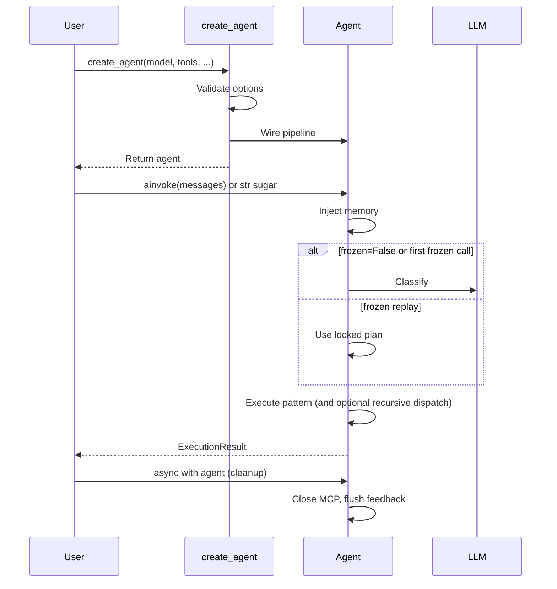

# The create_agent API

`create_agent` is the **only entry point** you need for production agents. Pass a LangChain-compatible model (and optional tools, memory store, policies); it returns an agent object with `ainvoke`, streaming helpers, and cleanup.

Under the hood agloom wires classification, pattern handlers, guardrails, and optional MCP — you do not assemble those pieces yourself.

!!! tip "Coming from LangChain `create_agent`?"
    agloom uses the **same invoke shape** (`{"messages": [...]}`) as [LangChain’s `create_agent`](https://docs.langchain.com/oss/python/langchain/agents). The factory is **async**, and `ainvoke` returns an **`ExecutionResult`** (not a raw graph state dict). Full porting guide: **[Migrating from LangChain — `create_agent`](../guides/migration-from-langchain.md#from-langchain-create_agent)**.

## Signature

```python
# Async usage (recommended)
agent = await create_agent(model=llm, tools=[...], name="my-agent")

# Sync usage (auto-detects event loop)
agent = create_agent_sync(model=llm, tools=[...], name="my-agent")
```

```python
async def create_agent(
    model,                          # Required: LLM instance
    tools=None,                     # Optional: LangChain tools
    system_prompt=None,             # Optional: str or callable
    name=None,                      # Optional: agent name
    debug=False,                    # Optional: debug logging
    # ... 30+ more parameters
) -> ...:  # agent instance with the methods below
```

See [All Parameters](../configuration/parameters.md) for the complete reference.

### Long-running harness (optional)

For agents that keep a **structured task graph**, **verification steps**, and **git** workflows across sessions, pass **`harness=True`** together with a LangGraph **`store=`**. That appends tools such as `bootstrap_progress`, `get_next_task`, `update_task`, and `git_status` / `git_commit`, and feeds **cross-session progress** into classification. **`harness=True` without `store=` is ignored** (with a log warning). The **agloom CLI** turns this on by default and supplies a **SQLite** LangGraph store (`graph_store.sqlite` under `.agloom/`) even when session memory is off. Details: [Harness](../features/harness.md).

### Recursive orchestration (optional)

Pass **`max_pattern_depth > 0`** to enable bounded recursive pattern dispatch (self-healing recovery, optional auto-escalation). Default is **`0`** (off). Agent parameters are **ceilings**; when **`orchestration_plan_from_classifier=True`** (default), the classifier sets per-turn depth and budgets inside those limits. Details: [Recursive orchestration](../features/orchestration.md).

### Frozen agents (optional)

Pass **`frozen=True`** to classify **once** per agent instance and replay the **classifier-derived plan** (pattern, subtasks, handler vs `dispatch_pattern`, orchestration limits) on every later call with new `messages` only. Same invoke shape as above. Details: [Frozen agents](../features/frozen-agents.md).

## What It Returns

The agent object exposes these methods:

| Method                                           | Description                                     |
| ------------------------------------------------ | ----------------------------------------------- |
| `await agent.ainvoke(input)`                     | Run the full pipeline, return `ExecutionResult` |
| `async for token in agent.astream(input)`        | Stream tokens as they arrive                    |
| `async for event in agent.astream_events(input)` | Stream structured events + real-time tokens     |
| `await agent.abatch(inputs)`                   | Process multiple inputs in parallel           |
| `await agent.feedback(run_id, rating)`           | Submit user feedback for a run                  |
| `agent.register_pattern(pattern_type, handler)`  | Register a custom pattern handler               |
| `async with agent:`                              | Context manager for graceful cleanup            |

### Invoke input (LangChain shape)

All runtime methods accept the same **input** as LangChain `create_agent`:

```python
# Canonical
await agent.ainvoke({
    "messages": [{"role": "user", "content": "What is the weather in Tokyo?"}],
})

# Sugar (wraps a single user message)
await agent.ainvoke("What is the weather in Tokyo?")
```

Use `system_prompt=` at `create_agent` for fixed instructions (especially with `frozen=True`). Each invoke supplies a new **user** message.

### Migrating from LangChain `create_agent`

If you already use [LangChain’s `create_agent`](https://docs.langchain.com/oss/python/langchain/agents), the port is small:

| | LangChain | agloom |
| --- | --- | --- |
| Import | `langchain.agents.create_agent` | `agloom.create_agent` |
| Build | `agent = create_agent(...)` | `agent = await create_agent(...)` |
| Invoke | `{"messages": [...]}` | **Same** (or plain `str`) |
| Result | `result["messages"]` | `result.output`, `result.messages`, `result.analysis` |

Full walkthrough (streaming, memory, pitfalls): **[Migrating from LangChain](../guides/migration-from-langchain.md#from-langchain-create_agent)**.

### Full Method Signatures

All runtime methods accept `thread_id`, `user_id`, and `context` for session management:

```python
# Primary async entry point
await agent.ainvoke(
    {"messages": [{"role": "user", "content": "..."}]},  # or plain str
    *,
    thread_id: str | None = None,    # session ID for memory isolation
    user_id: str | None = None,      # stable cross-session identity
    lt_namespace: tuple | None = None, # explicit shared namespace
    context: dict | None = None,     # arbitrary context dict
) -> ExecutionResult

# Token streaming (real for DIRECT, simulated for complex patterns)
async for token in agent.astream(
    {"messages": [{"role": "user", "content": "..."}]},
    *,
    thread_id: str | None = None,
    user_id: str | None = None,
    lt_namespace: tuple | None = None,
    context: dict | None = None,
    stream_mode: str = "tokens",     # "tokens" | "result"
) -> AsyncGenerator[str | ExecutionResult, None]

# Combined event + token streaming (real-time for ALL patterns)
async for event in agent.astream_events(
    {"messages": [{"role": "user", "content": "..."}]},
    *,
    thread_id: str | None = None,
    user_id: str | None = None,
    lt_namespace: tuple | None = None,
    context: dict | None = None,
) -> AsyncGenerator[AgentEvent, None]

# Batch processing
await agent.abatch(
    [{"messages": [{"role": "user", "content": "q1"}]}, "q2"],  # messages dict or str each
    *,
    thread_id: str | None = None,
    user_id: str | None = None,
    lt_namespace: tuple | None = None,
    context: dict | None = None,
    max_concurrent: int = 5,
) -> list[ExecutionResult]

# User feedback
await agent.feedback(
    run_id: str,                     # from result.run_id
    rating: str,                     # "positive" | "negative" | "neutral"
    *,
    comment: str = "",               # optional comment
    correct: str | None = None,      # correction text (when rating="negative")
    metadata: dict | None = None,    # arbitrary metadata
) -> None

# Custom pattern registration
agent.register_pattern(
    pattern_type: PatternType,       # e.g. PatternType.REACT
    handler_fn: Callable,            # async (agent, query, analysis, config) -> ExecutionResult
) -> None
```

### Identity Resolution

The `thread_id` and `user_id` parameters (passed at **call time**) control memory isolation:

| Parameter                       | Effect                                                                 |
| ------------------------------- | ---------------------------------------------------------------------- |
| `thread_id=None`                | Ephemeral UUID — no cross-call session memory                          |
| `thread_id="t1"`                | Stateful session — session memory active across calls with same ID     |
| `user_id="u123"` (at call time) | Stable cross-session LT namespace → `(agent_name, "u123")`             |
| `lt_namespace=(...)`            | Explicit shared namespace (multi-agent coordination, highest priority) |

!!! warning "`user_id` at create_agent vs call time"
    `create_agent(user_id="u123")` sets a config default but does **not** automatically scope long-term memory. You must pass `user_id=` on each `ainvoke()` / `astream()` / `astream_events()` call for it to take effect.

```python
async def example(agent):
    # Stateful conversation with session memory
    result = await agent.ainvoke("My name is Alice", thread_id="session-1")
    result = await agent.ainvoke("What is my name?", thread_id="session-1")

    # Cross-session user identity — pass user_id at CALL TIME
    result = await agent.ainvoke("I prefer dark mode", user_id="user-42")
    # Later, in a new session:
    result = await agent.ainvoke("What are my preferences?", user_id="user-42")
```

## Validation

Invalid options fail **before** any LLM call when you **await** `create_agent`. Examples:

- `await create_agent(model=None)` → `ValueError`: model is required  
- `await create_agent(model=llm, name="")` → `ValueError`: name must be non-empty  
- `await create_agent(model=llm, max_concurrent=0)` → `ValueError`: `1 ≤ max_concurrent ≤ 32`  
- `await create_agent(model=llm, interrupt_before=["INVALID"])` → `ValueError`: unknown pattern  

## Minimal vs Full Configuration

Minimal:

```python
async def main():
    agent = await create_agent(model=llm)
```

Full production setup:

```python
from agloom.feedback import LTSFeedbackHandler
from langgraph.store.memory import InMemoryStore

async def main():
    agent = await create_agent(
        model=llm,
        tools=[search, calculate],
        system_prompt="You are a data analyst.",
        name="analyst",
        store=InMemoryStore(),     # enables long-term memory, skills, feedback
        debug=False,
        max_concurrent=8,
        max_retries=3,
        llm_timeout=60.0,
        rate_limit=10.0,
        feedback_handler=LTSFeedbackHandler(),
    )
    result = await agent.ainvoke("Analyze data", thread_id="s1", user_id="analyst-1")
```

## Lifecycle


