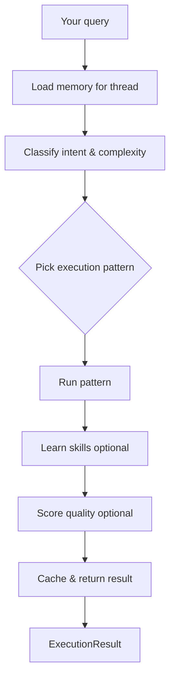
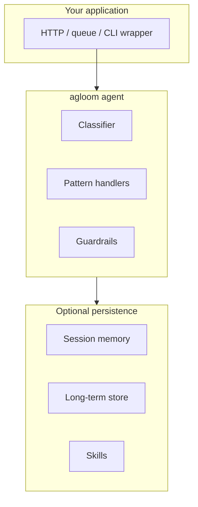

# How agloom works

For vocabulary (**turn**, **run**, **thread**, **checkpoint**), see the [Glossary](glossary.md).

---

## One API, one pipeline

Every turn starts the same way: you call `agent.ainvoke(...)`, `agent.astream(...)`, or a streaming variant. agloom does the rest.

You choose the **model**, **tools**, and **policies** (timeouts, HITL, memory store). agloom chooses **how** to execute each turn.

---

## What happens on each turn

### 1. Memory context

If you pass a **`thread_id`**, recent conversation turns are injected into the prompt. With a **`store=`** and **`user_id`**, long-term memories can be retrieved as well. No extra wiring for “session vs long-term” beyond those parameters.

### 2. Classification

A lightweight planning step analyzes the query and decides:

- Which **execution pattern** fits (DIRECT, REACT, SUPERVISOR, …)
- Rough **complexity** and whether work can run **in parallel**
- Optional **subtasks** for multi-agent patterns
- Optional **orchestration budget** when recursive depth is enabled

The structured analysis is on **`result.analysis`** (and in streaming events / AGP as `pattern.classified`).

### 3. Cache lookup

If semantic caching is enabled, a similar past query can return immediately — useful for FAQs and repeated analytics questions.

### 4. Human approval (optional)

If you configured interrupts and a **`user_callback`**, agloom can pause before a sensitive pattern, tool, or worker runs. See [Human-in-the-Loop](../features/hitl.md).

### 5. Pattern execution

The selected pattern runs with your tools and model. Examples:

| Pattern | Typical use |
| ------- | ----------- |
| **DIRECT** | Short answers, no tools |
| **REACT** | Tool-heavy research or coding |
| **SUPERVISOR** | Parallel subtasks with a manager |
| **PIPELINE** | Fixed multi-stage workflows |
| **REFLECTION** | Draft → critique → revise |

Full catalog: [Execution patterns](patterns.md).

With **`max_pattern_depth > 0`**, agloom can recover or escalate within the same turn (bounded budgets). See [Recursive orchestration](../features/orchestration.md).

### 6. Skill learning (optional)

Successful runs can be distilled into reusable **skills** when a **`store=`** is configured. Similar queries later get hints in the system prompt.

### 7. Quality feedback (optional)

When persistence is enabled, each run can be scored on relevance and completeness. Trends over time inform skill lifecycle (boost what works, decay what does not). See [Feedback & evaluation](../features/feedback.md).

### 8. Result

You receive an **`ExecutionResult`**:

| Field | Meaning |
| ----- | ------- |
| `output` | Final assistant text |
| `pattern_used` | Pattern that ran |
| `analysis` | Classifier output |
| `steps` | Trace of steps (tools, workers, timings) |
| `token_usage` | Aggregated token counts for the turn |
| `run_id` | Id for feedback or tracing |
| `worker_results` | Per-worker outputs when applicable |

---

## How this scales with you

| Stage | What changes | What stays the same |
| ----- | ------------ | ------------------- |
| Prototype | `create_agent` in a script | Same `ainvoke` / `astream` API |
| Product | Add `thread_id`, tools, HITL | Classification still automatic |
| Platform | Run `agloom-runtime`, multiple UIs on AGP | Same event types on the wire |
| Fleet | Remote workers behind runtime (future) | AGP session + thread model |

Concurrency is **async-first**: many turns can run in parallel with isolated state; configure **`max_concurrent_llm_calls`** and rate limits when load grows.

---

## Thread safety

- Lazy resources (MCP, skills) are initialized safely under load.
- LLM calls can be capped with a semaphore.
- Each **`ainvoke`** uses isolated turn state — no accidental cross-talk between requests when you use distinct **`thread_id`** values.

---

## Next steps

- [Quick start](../getting-started/quickstart.md) — runnable minimal agent
- [The `create_agent` API](create-agent.md) — methods and parameters
- [Streaming & events](../features/streaming.md) — build responsive UIs
- [Production integration](../guides/production.md) — deploy with confidence
