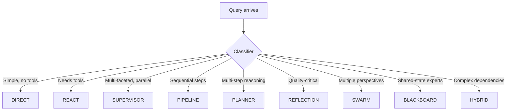
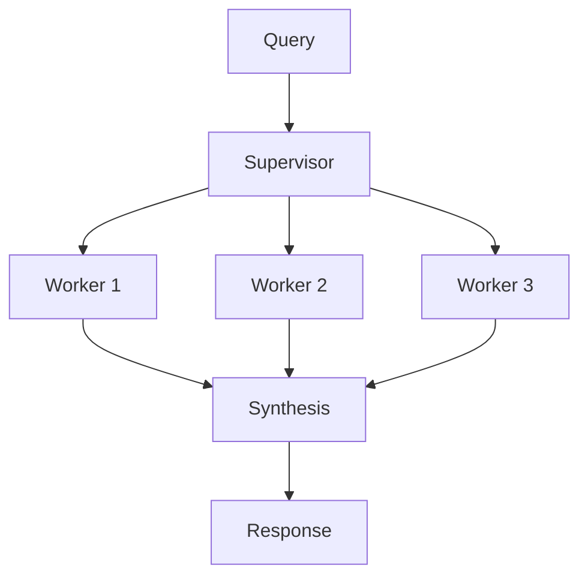
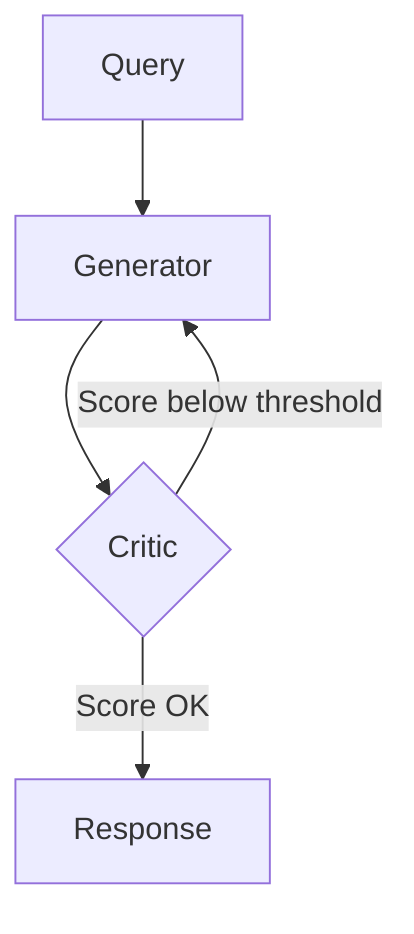

# Execution patterns

agloom **routes each query automatically**. You do not pick ReAct vs supervisor vs planner on every turn — a **classifier** analyzes complexity, tool need, and parallelism, then runs one of **nine built-in patterns**.

## How routing works



The classifier runs once per turn (bounded by **`classifier_timeout`**). Its decision is visible in logs, **`result.pattern_used`**, AGP **`thinking.step`** / **`pattern.selected`** events, and LangSmith traces.

!!! tip "You stay in control of tools and policy"
    Patterns control **orchestration shape**, not your business rules. Tools, HITL gates, memory, and skills apply regardless of which pattern runs.

---

## The nine patterns

### DIRECT — single LLM call

**When:** Greetings, facts, short instructions — no tools required.

```text
Query → LLM → Response
```

**Examples:** “What is the capital of France?”, “Hello!”, “Summarize in one line.”

---

### REACT — tool loop

**When:** The model must call tools (search, code, APIs).

```text
Query → LLM → Tool → Observation → LLM → … → Response
```

**Examples:** “Calculate 15 × 7 + 23”, “Search for the latest Python release.”

---

### SUPERVISOR — parallel workers + synthesis

**When:** Independent subtasks that can run in parallel.



**Examples:** “Compare solar, wind, and hydro energy”, “Analyze marketing, sales, and support metrics.”

Partial worker failures may still yield a synthesized answer — check **`worker_results`** in production ([Production guide](../guides/production.md)).

---

### PIPELINE — ordered stages

**When:** Fixed sequence of transformations.

```text
Query → Stage 1 → Stage 2 → Stage 3 → Response
```

**Examples:** “Extract data, format as a table, translate to Spanish.”

---

### PLANNER_EXECUTOR — plan then execute with full history

**When:** Later steps need everything that happened before.

```text
Query → Plan → Step 1 → Step 2 (+history) → Step 3 (+history) → Synthesis
```

**Examples:** “Research, draft, review, and finalize a project proposal.”

Unlike PIPELINE, each step sees **all prior step outputs**, not only the previous stage.

---

### REFLECTION — generate, critique, revise

**When:** Quality matters more than latency.



**Examples:** “Write a professional cover letter”, “Create a detailed technical specification.”

Tune with **`max_reflection_iterations`** (default 3) and **`reflection_threshold`** (default 7/10). Details: [Reflection](../features/reflection.md).

---

### SWARM — parallel perspectives

**When:** Debate or multiple viewpoints help.

```text
Query → [Expert A, Expert B, Expert C] → Synthesis → Response
```

**Examples:** “Pros and cons of microservices vs monolith?”

---

### BLACKBOARD — shared specialist state

**When:** Experts contribute to a evolving shared context.

```text
Query → Expert 1 (board) → Expert 2 (board+) → … → Synthesis
```

---

### HYBRID_DAG — mixed parallel and sequential

**When:** Some subtasks parallelize, then feed sequential steps.

```text
Query → [Parallel A, Parallel B] → Sequential C → Response
```

---

## Biasing routing (without forking the library)

| Mechanism | Use case |
| --------- | -------- |
| **Tools & system prompt** | Steer toward REACT when tools are registered |
| **`command.config.set` (AGP)** | Live pattern hint from CLI / web when supported |
| **Simpler queries** | Classifier often picks DIRECT — fewer tokens |
| **Custom pattern handler** | Replace behavior for one pattern (advanced) |

There is **no** public `fallback_pattern` YAML knob — if a pattern has no handler, agloom falls back to **REACT** and logs a warning.

---

## Advanced: custom pattern handlers

Framework authors can register a replacement handler for a pattern:

```python
from agloom import create_agent, ExecutionResult, PatternType

async def my_react(agent, query, analysis, config):
    return ExecutionResult(output="Custom result", pattern_used=analysis.pattern)

async def main():
    agent = await create_agent(model=llm, name="custom")
    agent.register_pattern(PatternType.REACT, my_react)
```

Most applications should **not** override handlers — use tools, memory, and HITL instead.

---

## See also

- [Choosing a pattern](../guides/choosing-a-pattern.md) — practical shortcuts
- [Orchestration](../features/orchestration.md) — workers, delegation, limits
- [Production integration](../guides/production.md) — worker failures and tokens
- [Parameters](../configuration/parameters.md) — timeouts, concurrency, reflection
