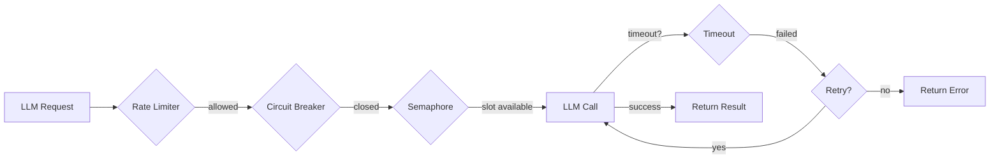

# Timeouts & Retries

## Built-In Reliability

agloom includes production-grade reliability features that would normally take weeks to build:

## Timeouts

| Parameter | Default | Controls |
|-----------|---------|----------|
| `llm_timeout` | `120.0s` | Max time for a single LLM call |
| `classifier_timeout` | `30.0s` | Max time for query classification |

```python
async def main():
    agent = await create_agent(
        model=llm,
        llm_timeout=60.0,         # 60s per LLM call
        classifier_timeout=15.0,   # 15s for classification
    )
```

If a timeout is exceeded, the call fails with a `TimeoutError` — no hanging forever.

## Retries

| Parameter | Default | Controls |
|-----------|---------|----------|
| `max_retries` | `2` | Worker retry count (0-10) |
| `retry_delay` | `1.0s` | Delay between retries |
| `structured_max_retries` | `2` | Structured output retries |

```python
async def main():
    agent = await create_agent(
        model=llm,
        max_retries=3,            # retry failed workers up to 3 times
        retry_delay=2.0,          # wait 2s between retries
        structured_max_retries=3, # retry structured output 3 times
    )
```

## Concurrency Control

| Parameter | Default | Controls |
|-----------|---------|----------|
| `max_concurrent` | `4` | Max parallel workers (1-32) |
| `rate_limit` | `None` | Max LLM calls per second |

```python
async def main():
    agent = await create_agent(
        model=llm,
        max_concurrent=8,   # up to 8 workers in parallel
        rate_limit=10.0,    # max 10 LLM calls per second
    )
```

## Circuit Breaker

agloom includes an automatic circuit breaker that fast-fails after consecutive LLM API failures. This prevents cascading failures when your LLM provider is down.

**Behavior:**

1. After N consecutive failures, the circuit **opens** — all calls fail immediately
2. After a cooldown period, the circuit enters **half-open** — one call is allowed through
3. If it succeeds, the circuit **closes** — normal operation resumes
4. If it fails, the circuit stays **open** for another cooldown

This is automatic — no configuration needed.

## Rate Limiter

Token-bucket rate limiting prevents hitting your LLM provider's rate limits:

```python
async def main():
    agent = await create_agent(
        model=llm,
        rate_limit=5.0,  # max 5 LLM calls per second
    )
```

With `rate_limit=None` (default), no rate limiting is applied.

## LLM Semaphore

The `max_concurrent` parameter controls how many LLM calls can run simultaneously across all workers. This prevents overloading your LLM API quota.

## Robust Structured Output

When `response_format=` is set, agloom uses `robust_structured_call()` internally:

1. Tries the primary structured output method (`with_structured_output`)
2. On failure, retries with `method="json_schema"`
3. On further failure, falls back to raw output and logs a warning

```
response_format: structured call returned None — using raw output.
response_format failed (Error) — using raw output.
```

## Summary


