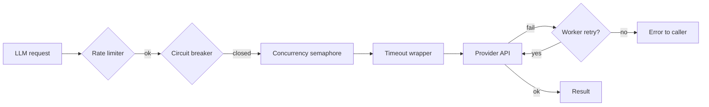

# Timeouts & retries

Production agents need bounded latency, retries on transient failures, and protection when upstream LLMs degrade. agloom ships these controls on **`create_agent`** — no custom middleware required.

## Quick reference

| Parameter | Default | Purpose |
| --------- | ------- | ------- |
| `llm_timeout` | `120.0` s | Max time per REACT/worker model call |
| `react_graph_timeout` | `max(llm_timeout × 4, 300)` s | Max wall clock for streamed REACT (`astream_events`) |
| `classifier_timeout` | `60.0` s | Max time for query classification |
| `max_retries` | `2` | Worker retries (0–10) |
| `retry_delay` | `1.0` s | Pause between worker retries |
| `structured_max_retries` | `2` | Retries for `response_format` formatting |
| `max_concurrent` | `4` | Parallel LLM calls cap (1–32) |
| `rate_limit` | `None` | Max LLM calls per second (token bucket) |

---

## Timeouts

```python
async def main():
    agent = await create_agent(
        model=llm,
        llm_timeout=60.0,
        classifier_timeout=15.0,
    )
```

When a timeout fires, REACT returns an actionable message (not a bare ``TimeoutError``). Tighten **`classifier_timeout`** in latency-sensitive APIs; for self-hosted Qwen + MCP tool loops use **`llm_timeout=300`** and **`react_graph_timeout=600`** (or higher).

---

## Retries

```python
async def main():
    agent = await create_agent(
        model=llm,
        max_retries=3,
        retry_delay=2.0,
        structured_max_retries=3,
    )
```

| Retry scope | What it covers |
| ----------- | -------------- |
| **`max_retries` / `retry_delay`** | Failed **workers** in supervisor-style patterns |
| **`structured_max_retries`** | Post-run formatting when **`response_format=`** is set |

Retries do **not** infinitely loop the whole agent — only the scoped step above.

---

## Concurrency and rate limiting

```python
async def main():
    agent = await create_agent(
        model=llm,
        max_concurrent=8,
        rate_limit=10.0,
    )
```

- **`max_concurrent`** — semaphore across all in-flight LLM calls (workers + main loop).
- **`rate_limit`** — token-bucket cap on **calls per second**; `None` disables limiting.

Use both when your provider enforces concurrent connections **and** requests-per-second.

---

## Circuit breaker (automatic)

After consecutive LLM API failures, agloom **opens** a circuit:

1. **Open** — new calls fail fast (no hammering a dead endpoint).
2. **Half-open** — after cooldown, one probe call is allowed.
3. **Closed** — success resumes normal traffic; failure reopens the circuit.

No configuration required — it protects cascading outages during provider incidents.

---

## Structured output resilience

With **`response_format=`**, a formatting pass runs after the main answer:

1. Primary structured-output path (provider-native when available).
2. On failure, retry with JSON-schema style binding.
3. After **`structured_max_retries`**, return raw assistant text and log a warning.

You will see log lines like:

```text
response_format: structured call returned None — using raw output.
response_format failed (Error) — using raw output.
```

Design schemas that tolerate one retry; do not rely on formatting for safety-critical validation without checking **`result.output`** parses.

---

## Request path (mental model)



---

## Tuning for production

| Scenario | Suggested starting point |
| -------- | ------------------------ |
| Interactive API | `llm_timeout=90`, `classifier_timeout=20`, `max_concurrent=4` |
| Batch analytics | `max_concurrent=8–16`, `rate_limit` = provider quota ÷ safety factor |
| Strict JSON APIs | `structured_max_retries=3`, validate output in your handler |
| Degraded provider | Circuit breaker + lower `max_concurrent` to avoid retry storms |

---

## See also

- [Production integration](../guides/production.md)
- [Parameters](parameters.md) — full `create_agent` table
- [Errors](errors.md) — exception messages
