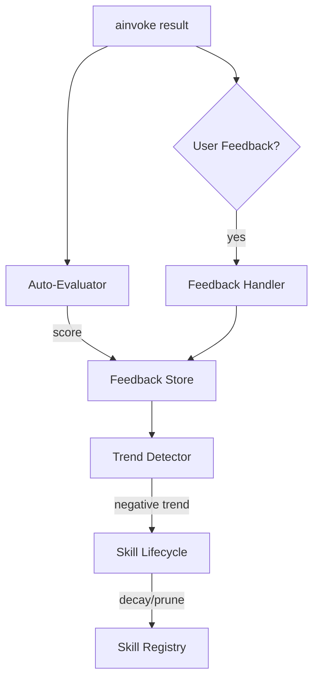

# Feedback & Evaluation

## Auto-Evaluation

Every `ainvoke` run is automatically scored by the `AutoEvaluator` on relevance, completeness, and accuracy. This happens transparently when `store=` is provided.

```python
async def main():
    agent = await create_agent(model=llm, store=store, name="eval-agent")
    result = await agent.ainvoke("Explain black holes")
    # Auto-evaluation runs in the background after every call
```

## User Feedback

Capture explicit user ratings and corrections:

```python
result = await agent.ainvoke("Explain quantum entanglement")

# User rates the response
await agent.feedback(
    run_id=result.run_id,
    rating="positive",              # "positive" | "negative" | "neutral"
    comment="Good but could be simpler",
)

# Submit a correction when the response was wrong
await agent.feedback(
    run_id=result.run_id,
    rating="negative",
    comment="Incorrect explanation of Bell's theorem",
    correct="Bell's theorem proves that...",  # correction text
)
```

!!! info "Non-fatal"
    If `feedback()` fails (e.g., store unavailable), it logs a warning and continues:
    `[agent-name] feedback() failed (...) — non-fatal.`

## Feedback Handlers

Control where feedback goes using handlers:

### LTSFeedbackHandler (default when store is provided)

Saves feedback to the long-term store. Signals skill decay for low-rated runs.

```python
from agloom.feedback.user_feedback import LTSFeedbackHandler

async def main():
    agent = await create_agent(
        model=llm,
        store=store,
        feedback_handler=LTSFeedbackHandler(),
    )
```

### WebhookFeedbackHandler

Posts feedback as JSON to an external URL (`httpx` is a core dependency of `agloom`):

```python
from agloom.feedback.user_feedback import WebhookFeedbackHandler

async def main():
    agent = await create_agent(
        model=llm,
        store=store,
        feedback_handler=WebhookFeedbackHandler(url="https://hooks.example.com/feedback"),
    )
```

### CompositeHandler

Chain multiple handlers — they run concurrently:

```python
from agloom.feedback.user_feedback import CompositeHandler, LTSFeedbackHandler, WebhookFeedbackHandler

handler = CompositeHandler([
    LTSFeedbackHandler(),
    WebhookFeedbackHandler(url="https://hooks.example.com/feedback"),
])

async def main():
    agent = await create_agent(model=llm, store=store, feedback_handler=handler)
```

!!! info "Error isolation"
    If one handler in a `CompositeHandler` fails, the others still run. The error is logged:
    `CompositeHandler: HandlerName failed for run run_id: error message`

### No feedback (default)

When no `feedback_handler` is provided and no `store` is set, feedback is silently disabled with zero overhead.

## Trend Detection

agloom tracks auto-eval scores over time and detects quality trends:

| Parameter | Default | What it does |
| --- | --- | --- |
| `review_every_n_runs` | `25` | Run auto-review every N runs |
| `trend_every_n_runs` | `100` | Run trend analysis every N runs |
| `low_score_threshold` | `0.40` | Scores below this trigger skill decay |

When a negative trend is detected, affected skills are decayed and eventually pruned from the registry.

## Feedback Flow


