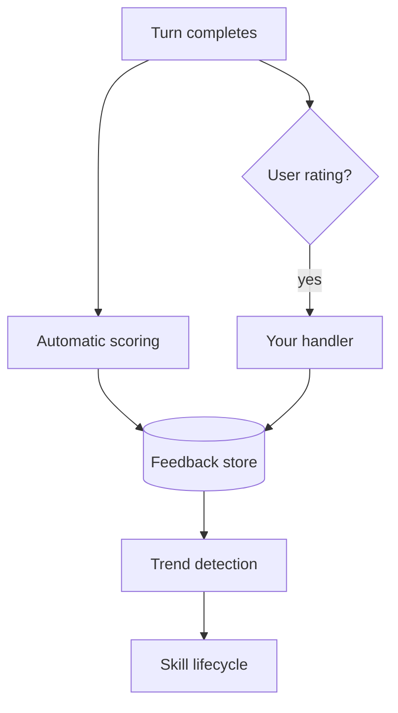

# Feedback & Evaluation

agloom can **score every run**, accept **user ratings**, and **adjust skills over time** when you provide a persistent **`store=`**.

---

## Automatic quality scoring

When a store is configured, each completed turn is scored on relevance, completeness, and accuracy in the background — no extra API calls from your app.

```python
agent = await create_agent(model=llm, store=store, name="eval-agent")
result = await agent.ainvoke("Explain black holes")
# Scoring runs after the turn; use result.run_id for user feedback
```

---

## User feedback

Capture explicit ratings and corrections:

```python
result = await agent.ainvoke("Explain quantum entanglement")

await agent.feedback(
    run_id=result.run_id,
    rating="positive",
    comment="Clear explanation",
)

await agent.feedback(
    run_id=result.run_id,
    rating="negative",
    comment="Wrong about Bell's theorem",
    correct="Bell's theorem shows that...",
)
```

!!! info "Non-fatal"
    If `feedback()` fails (e.g. store unavailable), agloom logs a warning and continues — your app is not interrupted.

---

## Where feedback is stored

| Handler | Behavior |
| ------- | -------- |
| **Default with `store=`** | Persists to long-term storage; low ratings can decay related skills |
| **Webhook** | POST JSON to your URL for CRM or analytics |
| **Composite** | Run multiple handlers in parallel |

```python
from agloom.feedback import CompositeHandler, LTSFeedbackHandler, WebhookFeedbackHandler

handler = CompositeHandler([
    LTSFeedbackHandler(),
    WebhookFeedbackHandler(url="https://hooks.example.com/feedback"),
])

agent = await create_agent(model=llm, store=store, feedback_handler=handler)
```

Without a **`store=`** and without a custom **`feedback_handler`**, feedback is a no-op with zero overhead.

---

## Trends and skill lifecycle

| Setting | Default | Effect |
| ------- | ------- | ------ |
| `review_every_n_runs` | `25` | Periodic quality review |
| `trend_every_n_runs` | `100` | Detect regressions over time |
| `low_score_threshold` | `0.40` | Scores below this decay skills |

When quality trends down, affected skills are down-weighted or pruned so the agent does not keep repeating weak strategies.

---

## How it fits together



---

## Related

- [Skill learning](skills.md)
- [Memory](memory.md)
- [All parameters — feedback](../configuration/parameters.md)
