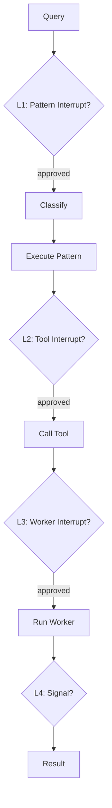

# Human-in-the-Loop (HITL)

Pause before risky **patterns**, **tools**, or **workers**, or inject **signals** mid-run. HITL is **opt-in** — omit interrupt parameters for fully automatic execution.

## 4 levels of control

agloom provides layered interrupt control — from coarse-grained pattern pauses to fine-grained tool-level approval:



## L1: Pattern Interrupts

Pause before or after a specific pattern runs:

```python
async def my_callback(context):
    print(f"Pattern {context['pattern']} selected. Approve? (y/n)")
    return True  # True = proceed, False = abort

async def main():
    agent = await create_agent(
        model=llm,
        interrupt_before=["SUPERVISOR", "PIPELINE"],
        interrupt_after=["REFLECTION"],
        user_callback=my_callback,
        name="guarded-agent",
    )
```

**When it fires:** After classification, before the pattern handler starts (for `interrupt_before`) or after it completes (for `interrupt_after`).

!!! warning "Callback required"
    If you set interrupt lists without `user_callback`, agloom logs a warning and all gates are **transparent** (fail-open) — execution continues without pausing. Pass `user_callback=async_fn` to activate real approvals.

## L2: Tool Interrupts

Pause before specific tools are called:

```python
async def main():
    agent = await create_agent(
        model=llm,
        tools=[delete_file, read_file, write_file],
        interrupt_before_tools=["delete_file", "write_file"],
        user_callback=my_callback,
        name="safe-agent",
    )
```

Read operations proceed automatically; destructive operations require approval.

### Wildcards (L2 and L3)

| List | Match all | Match one id |
|------|-----------|----------------|
| `interrupt_before_tools` / `interrupt_after_tools` | Include the literal token `tools` (every registered tool name) | List individual tool names, e.g. `delete_file` |
| `interrupt_before_workers` / `interrupt_after_workers` | `*` or `__all__` | List a worker id, e.g. `deployer` |

The string `workers` in a worker interrupt list is **not** a wildcard — it only matches a worker whose id is literally `workers`. Use `*` or `__all__` to gate every worker.

At L3-before, responding with `skip` / `abort` / `no` / `cancel` skips that worker; the pattern run is still treated as a **successful** user decline (not `AllPatternWorkersFailed`), with `metadata.user_skipped_workers` when applicable.

## L3: Worker Interrupts

For multi-agent patterns (SUPERVISOR, PIPELINE, etc.), pause before or after specific workers:

```python
async def main():
    agent = await create_agent(
        model=llm,
        interrupt_before_workers=["deployer"],
        interrupt_after_workers=["researcher"],
        user_callback=my_callback,
        name="supervised-agent",
    )
```

## L4: Signal Queue

For programmatic control during execution. Each `ainvoke()` normally allocates a fresh
`signal_queue`. To **inject a queue you hold** (e.g. from a sibling task), pass it under
``context["configurable"]`` — it overrides the auto-created queue for that call only:

```python
import asyncio
from agloom import SignalType
from agloom.models import Signal

async def run_with_halt(agent):
    signal_queue = asyncio.Queue()

    async def halter():
        await asyncio.sleep(5)
        await signal_queue.put(Signal(signal_type=SignalType.HALT_ALL))

    bg = asyncio.create_task(halter())
    try:
        result = await agent.ainvoke(
            "Long research query",
            thread_id="research-session",
            context={"configurable": {"signal_queue": signal_queue}},
        )
    finally:
        bg.cancel()
        try:
            await bg
        except asyncio.CancelledError:
            pass
    return result
```

!!! note "Per-run isolation"
    Omitting ``signal_queue`` in ``context`` keeps the default: each `ainvoke()` gets its own queue.
    Two concurrent `ainvoke()` calls still cannot interfere unless you incorrectly share one queue across both.

## The user_callback Function

The callback receives context about the pending action:

```python
async def my_callback(context: dict) -> bool:
    """
    Return True to proceed, False to abort.
    context contains: action, pattern, tool_name, details, etc.
    """
    action = context.get("action", "unknown")
    print(f"Agent wants to: {action}")
    return True
```

!!! info "Error handling"
    If `user_callback` raises an exception, agloom catches it, logs a warning, and **continues** (fail-open):
    `[HITL-L1] user_callback raised Error(...) — continuing (fail-open).`

## Worker Clarification Requests

In multi-agent patterns (SUPERVISOR, PIPELINE, etc.), individual workers can ask the user for clarification during execution. This is handled automatically via the `ask_for_clarification` tool:

1. A worker encounters ambiguity and calls `ask_for_clarification("What format do you prefer?")`
2. The signal is routed through L4 (`signal_queue`) as a `CLARIFICATION_REQUEST`
3. Your `user_callback` receives the question and returns an answer
4. The answer is routed back to the specific worker (no cross-talk between concurrent workers)

```python
async def my_callback(context: dict) -> bool | str:
    action = context.get("action", "")
    if action == "clarification_request":
        question = context.get("question", "")
        print(f"Worker asks: {question}")
        return input("Your answer: ")  # return the answer string
    return True  # approve other actions

async def main():
    agent = await create_agent(
        model=llm,
        user_callback=my_callback,
        name="clarifying-agent",
    )
```

Workers time out after **300 seconds** if no answer is received, and continue with a fallback message.

### HALT_ALL worker signal

When ``HALT_ALL`` cancels or skips workers, their ``WorkerResult.signal`` is ``HALTED`` (not ``FAILED``).
Patterns treat ``HALTED`` as a deliberate user stop — not ``AllPatternWorkersFailed`` and not an upstream
failure for sequential chains.

## Step Tracing

HITL interrupts appear in the step trace:

```python
result = await agent.ainvoke("Deploy the application")

for step in result.steps:
    if step.type.value == "interrupt":
        print(f"Interrupted: {step.name}")
```

## Graph interrupt resume (library)

For graph interrupts (not AGP **`command.session.resume`** replay), use **`await agent.resume(value, thread_id=…)`** with a **`checkpointer`**. The agent continues with the same pattern it chose before the pause. See [Production — Resuming interrupted runs](../guides/production.md#resuming-interrupted-runs) and [All parameters — `resume()`](../configuration/parameters.md#graph-resume).

## Persistent tool allowlist (runtime)

When using **`agloom-runtime`** with tool-level HITL, approved tools can be persisted so repeat calls skip the prompt. See **[HITL tool allowlist](hitl-allowlist.md)** for JSON format and **`--hitl-allowlist-path`** / **`--no-hitl-allowlist-persist`**.

## Disabling HITL

Simply don't pass any interrupt parameters — HITL is opt-in, not opt-out:

```python
async def main():
    # No HITL — runs without any pauses
    agent = await create_agent(model=llm, name="auto-agent")
```
