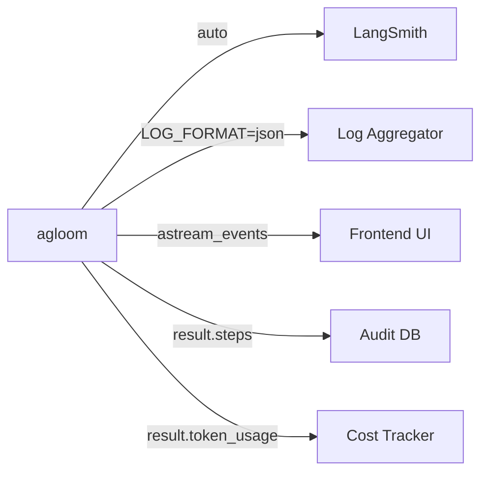

# Observability & LangSmith

## LangSmith Integration

agloom is built on LangChain and LangGraph, so **LangSmith tracing works automatically**. Every LLM call, tool invocation, and agent step shows up in your LangSmith dashboard without any code changes.

### Enabling LangSmith

Set these environment variables:

```bash
export LANGSMITH_API_KEY="lsv2_..."  # pragma: allowlist secret
export LANGSMITH_TRACING=true
export LANGSMITH_PROJECT="my-agloom-project"
```

That's it. Every `ainvoke`, `astream`, and `astream_events` call is traced automatically.

### Disabling LangSmith

```bash
export LANGSMITH_TRACING=false
```

Or simply don't set `LANGSMITH_API_KEY`.

### What You See in LangSmith

- **Full execution trace** — from query arrival to response
- **LLM calls** — inputs, outputs, token usage, latency
- **Tool calls** — which tools were called, with what inputs, and what they returned
- **Pattern classification** — which pattern was selected and why
- **Worker execution** — for multi-agent patterns, each worker's trace
- **Token usage** — aggregated across all calls

## Structured Logging

agloom ships with **structlog** (stdlib integration) for package logs:

### Enable Debug Logging

```python
async def main():
    agent = await create_agent(model=llm, debug=True, name="debug-agent")
```

With `debug=True`, you see detailed logs for every pipeline step:

```text
21:04:29 INFO  classifier — [Classifier] Pattern=DIRECT | Complexity=0/10
21:04:29 INFO  agent — [my-agent] DIRECT short-circuit — 1 LLM call total.
21:04:29 DEBUG agent — [my-agent] Analysis: {pattern: DIRECT, complexity: 0, ...}
```

With `debug=False` (default), only INFO-level and above logs are shown.

### Log Format

Set the `LOG_FORMAT` environment variable:

```bash
export LOG_FORMAT=json   # structured JSON (for log aggregators)
export LOG_FORMAT=text   # human-readable (default)
```

### Package-Level Logging Control

```python
from agloom import configure_package_logging

configure_package_logging(debug=True)   # DEBUG on all agloom loggers
configure_package_logging(debug=False)  # INFO (default)
```

Details: [Logging & debug](../configuration/logging.md). Live **thinking trace** UI data comes from streaming/AGP events, not these logs — see [Thinking trace & reasoning streams](thinking-events.md).

## Step Tracing

Every `ExecutionResult` includes a `steps` list — a complete audit trail:

```python
result = await agent.ainvoke("Complex query")

for step in result.steps:
    print(f"[{step.type.value:12s}] {step.name} — {step.duration_ms:.0f}ms")
    if step.metadata:
        print(f"  metadata: {step.metadata}")
```

### Step fields

| Field         | Type       | Description                                                                       |
| ------------- | ---------- | --------------------------------------------------------------------------------- |
| `type`        | `StepType` | classify, llm_call, tool_call, tool_result, worker_start, worker_end, token, etc. |
| `name`        | `str`      | Step identifier                                                                   |
| `input`       | `str`      | What went in                                                                      |
| `output`      | `str`      | What came out                                                                     |
| `id`          | `str`      | Tool call correlation ID (for `tool_call`/`tool_result` steps)                    |
| `duration_ms` | `float`    | How long it took                                                                  |
| `timestamp`   | `str`      | ISO 8601 timestamp                                                                |
| `metadata`    | `dict`     | Additional context                                                                |

## Raw Messages

`result.messages` contains the raw LangChain message objects (`HumanMessage`, `AIMessage`, `ToolMessage`, etc.) from the execution. See [Streaming — Raw Messages](streaming.md#5-raw-langchain-messages) for usage.

## Token Usage Tracking

```python
result = await agent.ainvoke("Explain photosynthesis")
print(result.token_usage)
# {'input_tokens': 245, 'output_tokens': 512, 'total_tokens': 757}
```

Token usage is aggregated across **all** LLM calls in a run — including classification, worker calls, and synthesis steps. For how **`metric.tokens`** on the AGP wire avoids double-counting, see [Wire tokens & metric.tokens](wire-tokens.md). When providers omit dollar amounts, **`metric.cost`** may be marked **`estimated": true`** (approximate only).

## Event Streaming for UI

See [Streaming & Events](streaming.md) for the `astream_events()` API that provides real-time observability for frontend UIs.

## Observability Stack Example


