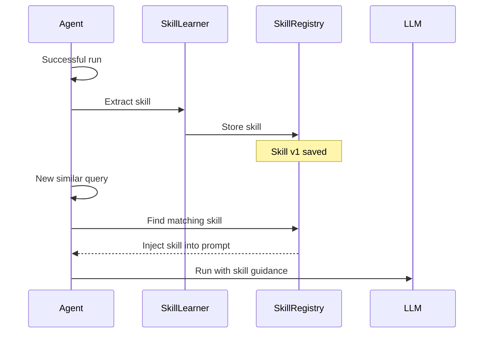
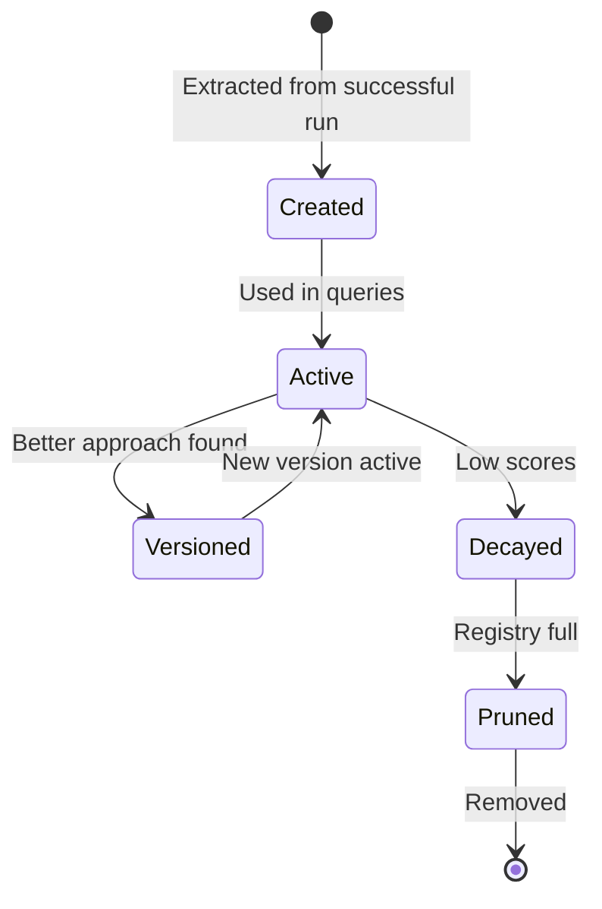

# Skill Learning

Agents can **remember what worked** and reuse successful strategies on similar questions — enable with a LangGraph **`store=`**.

## What are skills?

Skills are reusable execution patterns extracted from successful agent runs. When your agent handles a query well, the skill learner captures *how* it was done and stores it for future use.

## How It Works



## Enabling Skills

Skills activate automatically when you provide a `store`:

```python
from langgraph.store.memory import InMemoryStore

async def main():
    agent = await create_agent(
        model=llm,
        store=InMemoryStore(),
        name="learning-agent",
    )
```

That's it. No extra configuration needed.

## Skill Lifecycle



1. **Created** — extracted from a successful run
2. **Active** — injected into future queries, accumulating scores
3. **Versioned** — updated when a better approach is discovered
4. **Decayed** — marked for review after consistently low auto-eval scores
5. **Pruned** — removed when the registry exceeds `max_skills`

## Configuration

| Parameter             | Default | Description                         |
| --------------------- | ------- | ----------------------------------- |
| `store`               | `None`  | Required — enables the skill system |
| `max_skills`          | `30`    | Maximum skills in the registry      |
| `low_score_threshold` | `0.40`  | Scores below this trigger decay     |
| `review_every_n_runs` | `25`    | Auto-review frequency               |

## Observability on the wire

When skills are injected before classification, agloom emits **`skill.applied`** with:

- **`skills`** — which manifests were matched (legacy parsers may still send `skill_names`)
- **`context_preview`** — the catalogue text sent to the classifier (truncated at 8 KB on the wire)
- **`injected_chars`** — full in-process length

Full skill bodies appear only after **`load_skill`** (`skill.loaded` with `body_chars`).

## What Gets Captured

Each skill stores:

- **Pattern used** (DIRECT, REACT, etc.)
- **System prompt context** that worked
- **Tool sequence** if tools were involved
- **Subtask decomposition** for multi-agent patterns
- **Quality score** from auto-evaluation

## Without Skills

If you don't need learning, don't provide a `store`:

```python
async def main():
    agent = await create_agent(model=llm, name="stateless")
    # Each query starts fresh — no skill extraction or injection
```

!!! info "Seed generation"
    On the first run with a new store, agloom attempts to generate seed skills from the system prompt. If this fails, it logs a non-fatal warning:
    `[agent-name] seed skill generation failed (...) — non-fatal.`
