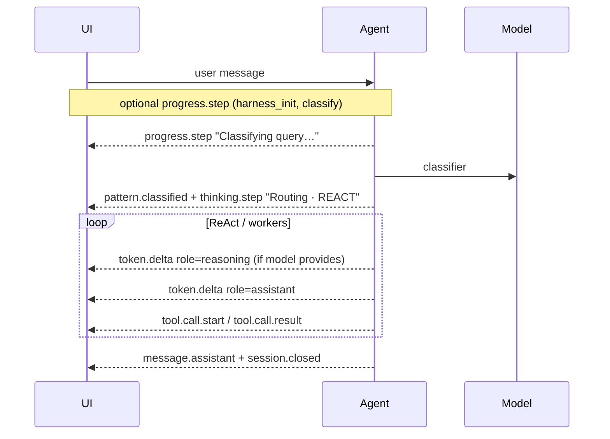

# Thinking trace & reasoning streams

Build UIs that show **what the agent is doing** (classify, harness bootstrap, tool warnings) separately from **what the model is saying** (answer tokens) and, when the provider supports it, **model-native reasoning** (chain-of-thought style text that is not the final reply).

agloom surfaces all three through the same streaming APIs you already use — no extra wiring per pattern.

---

## Two kinds of “thinking”

| Kind | What the user sees | In-process (`astream_events`) | On the wire (AGP) |
| ---- | ------------------ | ----------------------------- | ----------------- |
| **Trace steps** | Short status lines (“Classifying query…”, “Routing · REACT”) | `AgentEvent` with `type="progress"` or `type="classify"` | `progress.step`, `pattern.classified`, `thinking.step` (routing rationale) |
| **Reasoning tokens** | Collapsible reasoning panel (provider-dependent) | `AgentEvent` with `type="token"` and `data["role"] == "reasoning"` | `token.delta` with `role: "reasoning"` |
| **Answer tokens** | Main chat bubble | `type="token"`, default role | `token.delta`, `role: "assistant"` |

Trace steps are **always on** during streaming. Reasoning tokens appear only when the **chat model** returns separable reasoning content (e.g. Anthropic extended thinking, DeepSeek `reasoning_content`, or similar blocks in stream chunks). If the model does not expose reasoning, you only see trace steps plus assistant tokens.

---

## Typical turn timeline



---

## Trace steps — `astream_events()`

Subscribe to **`progress`**, **`thinking`**, and **`classify`** events. Infrastructure setup uses **`progress`**; routing rationale after classify uses **`thinking`** / **`classify`**.

### `progress` — infrastructure setup

Emitted **before and during** pre-REACT bootstrap (harness load, classify spinner, skills seed). Common `data` fields:

| Field | Meaning |
| ----- | ------- |
| `phase` | Setup phase (`classify`, `harness_init`, `skills_init`) |
| `name` | Step id (e.g. `analyze_query`, `harness_bootstrap`) |
| `output` | Human-readable line for a trace pane |

On AGP this becomes **`progress.step`**.

### `thinking` — routing and reflections

Emitted for routing rationale and other non-infra trace lines (not replayed at the end for prep spinners). Common `data` fields:

| Field | Meaning |
| ----- | ------- |
| `name` | Step id for your UI (e.g. `analyze_query`, `harness_bootstrap`) |
| `output` | Human-readable line to show in a trace pane |
| `duration_ms` | Optional, when timing is known |

#### Example — classify spinner

```python
async for event in agent.astream_events(
    "Summarize the repo README",
    thread_id="demo",
):
    if event.type == "thinking" and event.data.get("name") == "analyze_query":
        ui.set_status(event.data.get("output", "Working…"))
    elif event.type == "classify":
        ui.set_status(f"Pattern: {event.data.get('pattern')} · {event.data.get('reason', '')}")
    elif event.type == "token":
        role = event.data.get("role", "assistant")
        if role == "reasoning":
            ui.append_reasoning(event.data["content"])
        else:
            ui.append_answer(event.data["content"])
    elif event.type == "done":
        ui.finish(event.data["result"]["output"])
```

### `classify` — routing decision

Fires when classification finishes. Use it to show the chosen pattern and rationale:

| Field | Meaning |
| ----- | ------- |
| `pattern` | Execution pattern for this turn (e.g. `REACT`, `SUPERVISOR`) |
| `complexity` | Classifier score when present |
| `reason` | Short routing explanation |
| `duration_ms` | Classifier latency |

On AGP this becomes **`pattern.classified`** plus a **`thinking.step`** whose label looks like `Routing · REACT` (see [AGP — thinking.step](../protocol/agp.md#thinkingstep)).

### Harness-enabled sessions

With **`harness=True`** and a LangGraph **`store`**, you may see **`progress.step`** with `phase: harness_init` before classification when tasks exist — e.g. harness ready summary. Same when `task_count == 0`: silent on the wire (debug log only). Details in [Long-running harness](harness.md).

---

## Trace steps — AGP (`astream_agp_events()` / runtime)

Infrastructure setup uses **`progress.step`**; routing rationale after classify uses **`thinking.step`**.

```json
{
  "type": "progress.step",
  "data": {
    "phase": "classify",
    "label": "analyze_query",
    "detail": "Classifying query…",
    "elapsed_ms": null
  }
}
```

| Field | Use in UI |
| ----- | --------- |
| `phase` | Setup phase (`classify`, `harness_init`, `skills_init`) |
| `label` | Step id (`analyze_query`, `harness_bootstrap`, …) |
| `detail` | Body text for the trace row |
| `elapsed_ms` | Optional timing badge |

```json
{
  "type": "thinking.step",
  "data": {
    "step": "analyze_query",
    "label": "Routing · REACT",
    "detail": "needs file tools",
    "elapsed_ms": 87
  }
}
```

| Field | Use in UI |
| ----- | --------- |
| `label` | Primary step id (often routing line after `pattern.classified`) |
| `detail` | Body text for the trace row |
| `step` | Event category on the wire |
| `elapsed_ms` | Optional timing badge |

**`pattern.classified`** — emit once per turn after the classifier; drive pattern badges and analytics.

```json
{
  "type": "pattern.classified",
  "data": {
    "pattern": "REACT",
    "complexity": 4,
    "confidence": 0.92,
    "reason": "needs tools"
  }
}
```

### Example — AGP consumer

```python
async for evt in agent.astream_agp_events("Plan Q3 roadmap", thread_id="t1"):
    if evt.type == "progress.step":
        ui.status(evt.data.label or evt.data.phase, evt.data.detail or "")
    elif evt.type == "thinking.step":
        ui.trace(evt.data.label or evt.data.step, evt.data.detail or "")
    elif evt.type == "pattern.classified":
        ui.set_pattern_badge(evt.data.pattern)
    elif evt.type == "token.delta":
        if evt.data.role == "reasoning":
            ui.append_reasoning(evt.data.text)
        else:
            ui.append_answer(evt.data.text)
```

Full catalog: [AGP — Agloom Protocol](../protocol/agp.md).

---

## Model-native reasoning tokens

When the provider streams **reasoning separately from the final answer**, agloom forwards it as normal token events with an explicit role:

| API | Field |
| --- | ----- |
| `astream_events()` | `event.data["role"] == "reasoning"`, text in `content` |
| AGP | `token.delta` with `"role": "reasoning"` |

```json
{
  "type": "token.delta",
  "data": {
    "text": "First I should list the repo root…",
    "role": "reasoning",
    "message_id": "m1"
  }
}
```

### UI guidance

- Render **`reasoning`** in a secondary panel (muted, collapsible, or “Thought process”).
- Render **`assistant`** in the main message stream.
- Do not concatenate reasoning into the user-visible answer unless the product intentionally shows chain-of-thought.
- Redacted provider blocks may appear as a short placeholder line in the reasoning stream.

Assistant and reasoning deltas preserve **whitespace** — do not trim `token.delta.text` when appending.

---

## Other events that show up in the trace pane

The same stream may include **`reflection`**, **`fallback`**, **`cache_hit`**, **`llm_call`**, **`tool_call`**, **`worker_start`**, and more. Unmapped event types are still forwarded on AGP as **`thinking.step`** so observability clients never lose data. See [Streaming & events](streaming.md) for the full in-process catalog.

---

## Official CLI and web workspace

The **agloom CLI** and **web workspace** consume AGP: trace rows from **`thinking.step`** / **`pattern.classified`**, answer text from **`token.delta`** (`assistant`), and reasoning from **`token.delta`** (`reasoning`). You can match that layout in custom clients using the examples above.

---

## Related

- [Streaming & events](streaming.md) — `astream`, `astream_events`, `astream_agp_events`
- [Wire tokens & metric.tokens](wire-tokens.md) — per-turn token metrics
- [AGP protocol](../protocol/agp.md) — v1 wire reference
- [Logging & debug](../configuration/logging.md) — server-side structlog (not the live trace UI)
- [Long-running harness](harness.md) — bootstrap trace lines when harness is on
