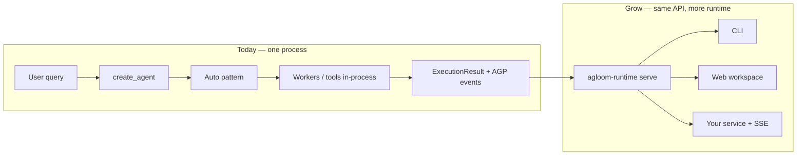

# Integration overview

Most teams only need one import:

```python
from agloom import create_agent
```

That is the **application path**: you supply a model and tools; agloom classifies each turn, runs the right execution pattern, streams progress, and returns a rich `ExecutionResult`. The rest of this site documents that path end to end.

---

## What you build vs what agloom runs

| You provide | agloom handles automatically |
| ----------- | ---------------------------- |
| LangChain-compatible **model** | Per-turn **pattern** selection (nine strategies) |
| LangChain **`create_agent` invoke shape** | Same `{"messages": [...]}` input — see [migration guide](migration-from-langchain.md#from-langchain-create_agent) |
| Optional **tools** | Tool loops, worker pools, pipelines, reflection |
| Optional **`thread_id`** | Session memory injection |
| Optional **`store=`** | Long-term memory, skills, quality scoring |
| Optional **HITL callback** | Interrupts before patterns, tools, or workers |
| Your **transport** (HTTP, CLI, queue) | Same agent pipeline everywhere |

You do **not** wire routers, retry policies, token accounting, or “thinking step” events by hand unless you want to customize them.

---

## Three ways to integrate

### 1. In-process agent (most common)

Embed the agent in your API, notebook, or batch job:

```python
agent = await create_agent(model=llm, tools=[search], name="support")
result = await agent.ainvoke("Summarize ticket #4421", thread_id="ticket-4421")
```

**Best for:** FastAPI services, internal tools, ETL, notebooks.  
**Start here:** [Quick start](../getting-started/quickstart.md) · [Production](../guides/production.md)

### 2. Streaming UI without writing a protocol layer

Show tokens and steps in your own UI:

```python
async for event in agent.astream_events("Plan a release"):
    if event.type == "token":
        ui.append_token(event.data["content"])
    elif event.type == "tool_call":
        ui.show_tool(event.data["name"], event.data["input"])
```

**Best for:** Custom chat widgets, Slack bots, desktop apps.  
**Guide:** [Streaming & events](../features/streaming.md) · [Thinking trace & reasoning](../features/thinking-events.md)

### 3. AGP-native clients (CLI, web, observability)

If your client speaks **Agloom Protocol (AGP)** — like the official CLI and web workspace — use the same event shapes the runtime emits:

```python
async for evt in agent.astream_agp_events("Hello", thread_id="demo"):
    if evt.type == "token.delta":
        print(evt.data.text, end="", flush=True)
```

**Best for:** Products that want session replay, HITL prompts, and metrics on the wire.  
**Guides:** [AGP specification](../protocol/agp.md) · [Custom transports](embedding-runtime.md) · [AGP in Python](agp-python.md)

---

## Scaling story (without custom orchestration code)



1. **Start** with `create_agent` in your app — classification, memory, and guardrails are already on.
2. **Add** `astream_events` or `astream_agp_events` when you need live UX.
3. **Move** the process boundary to `agloom-runtime` when multiple clients or machines share one agent — AGP stays the contract.

Depth on recursive patterns and budgets: [Recursive orchestration](../features/orchestration.md).  
Depth on deployment: [Production deployment](deployment.md).

---

## Documentation map

| I want to… | Read |
| ---------- | ---- |
| Understand the product | [Why agloom?](../getting-started/why-agloom.md) |
| Run my first agent | [Quick start](../getting-started/quickstart.md) |
| See how a turn flows | [How it works](../concepts/how-it-works.md) |
| Pick patterns conceptually | [Execution patterns](../concepts/patterns.md) |
| Embed AGP in my server | [Embedding the runtime](embedding-runtime.md) |
| Operate in production | [Production integration](../guides/production.md) |

The **Architecture** section of the site is for operators and integrators who run `agloom-runtime` or build observability pipelines — not required for everyday `create_agent` usage.
