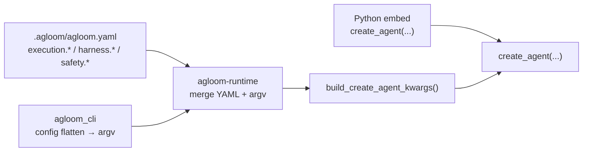
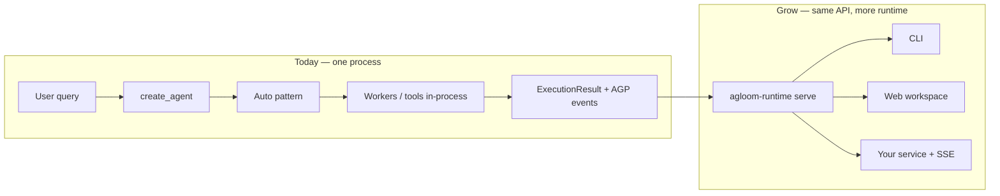

# Integration overview

Most teams only need one import:

```python
from agloom import create_agent
```

That is the **application path**: you supply a model and tools; agloom classifies each turn, runs the right execution pattern, streams progress, and returns a rich `ExecutionResult`. The rest of this site documents that path end to end.

---

## What you build vs what agloom runs

| You provide | agloom handles automatically |
| --- | --- |
| LangChain-compatible **model** | Per-turn **[turn planner](../concepts/turn-planner.md)** → pattern selection (nine strategies) |
| LangChain **`create_agent` invoke shape** | Same `{"messages": [...]}` input — see [migration guide](migration-from-langchain.md#from-langchain-create_agent) |
| Optional **tools** | Tool loops, worker pools, pipelines, reflection |
| Optional **`thread_id`** | Session memory injection |
| Optional **`store=`** | Long-term memory, skills, quality scoring |
| Optional **`store=`** + **`harness_metadata`** | Durable task ledger, focus injection, progress/git tools — [harness](../features/harness.md) |
| Optional **HITL callback** | Interrupts before patterns, tools, or workers |
| Your **transport** (HTTP, CLI, queue) | Same agent pipeline everywhere |

You do **not** wire routers, retry policies, token accounting, or “thinking step” events by hand unless you want to customize them.

---

## Configuration contract (single source of truth)

**Agent behavior is configured only through `create_agent` kwargs** — timeouts, harness scope, tool approval, memory tools, orchestration ceilings, and similar tuning. agloom does **not** read `AGLOOM_LLM_TIMEOUT`, `AGLOOM_HARNESS_ENABLED`, `AGLOOM_TOOL_AUTO_APPROVE`, or other agent-tuning environment variables.

Every integration path converges on the same factory call:


```mermaid
flowchart LR
  PY["Python embed\ncreate_agent(...)"]
  YAML[".agloom/agloom.yaml\nexecution.* / harness.* / safety.*"]
  CLI["agloom_cli\nconfig flatten → argv"]
  RT["agloom-runtime\nmerge YAML + argv"]
  KW["build_create_agent_kwargs()"]
  CA["create_agent(...)"]

  PY --> CA
  YAML --> RT
  CLI --> RT
  RT --> KW --> CA
```

### How each path maps to `create_agent`

| Integration | You configure | Runtime maps to |
| --- | --- | --- |
| **Python library** | Kwargs on `await create_agent(...)` | Direct — no YAML or bridge |
| **`agloom-runtime serve`** | `agloom.yaml` + serve flags (`--llm-timeout`, `--no-harness`, …) | `merge_agloom_yaml_into_namespace` → `build_create_agent_kwargs` |
| **npm CLI** | Same YAML + Commander flags; execution via YAML or `agloom -- --llm-timeout 800` | `buildRuntimeArgs()` → runtime argv → same merge path |
| **Web workspace** | Connects to runtime over WebSocket; inherits runtime/YAML config | Per-connection merge in `prepare_runtime_session` |
| **AGP hot reload** | `command.config.set` on the wire | **Limited** — model, sampling, `system_prompt`, session budgets only (not execution timeouts today) |

### YAML blocks (CLI / runtime)

```yaml
execution:
  llm_timeout: 120.0
  classifier_timeout: 60.0   # → turn_planner_timeout
  react_graph_timeout: 600.0
  max_concurrent: 4
harness:
  project_name: my-project
  goal: Ship feature X
  enabled: false               # → --no-harness
safety:
  require_approval: false      # → --no-require-tool-approval
```

CLI flags and explicit `agloom-runtime serve` argv **win** over YAML. See [All parameters](../configuration/parameters.md), [Runtime CLI](../runtime/cli.md), and [CLI config](../../agloom_cli/config.md).

### What environment variables *are* for

| Category | Examples | Purpose |
| --- | --- | --- |
| **Provider credentials** | `OPENAI_API_KEY`, `GROQ_API_KEY`, … | Upstream LLM auth |
| **Bridge / model defaults** | `AGLOOM_RUNTIME`, `AGLOOM_MODEL`, `AGLOOM_PROVIDER` | Find `agloom-runtime`; default model when YAML/CLI omit `-m` |
| **Session security** | `AGLOOM_OMIT_API_KEY_FROM_SESSION` | Control what session markers persist |
| **Observability** | LangSmith / OTEL env | Tracing and dashboards |
| **Tool integrations** | `AGLOOM_SEARCH_PROVIDER` | Optional web-search backend for CLI tools |

**Not** for agent tuning: harness on/off, LLM timeouts, memory-tool toggles, store/skills enablement, or tool auto-approval.

### Observability on the wire (AGP)

Clients learn resolved config from events — not from env:

| Signal | Meaning |
| --- | --- |
| `runtime.ready.harness_enabled` | Harness on/off for this attachment |
| `runtime.config` | Model, tool names, capabilities after bootstrap |
| Session marker `effective_config` | Serializable snapshot for stdio resume (includes execution fields when set) |

Full wire reference: [AGP specification](../protocol/agp.md).

---

## Three ways to integrate

### 1. In-process agent (most common)

Embed the agent in your API, notebook, or batch job:

```python
agent = await create_agent(model=llm, tools=[search], name="support")
result = await agent.ainvoke("Summarize ticket #4421", thread_id="ticket-4421")
```

**Best for:** FastAPI services, internal tools, ETL, notebooks.  
**Start here:** [Quick start](../getting-started/quickstart.md) · [Production](../guides/production.md)

### 2. Streaming UI without writing a protocol layer

Show tokens and steps in your own UI:

```python
async for event in agent.astream_events("Plan a release"):
    if event.type == "token":
        ui.append_token(event.data["content"])
    elif event.type == "tool_call":
        ui.show_tool(event.data["name"], event.data["input"])
```

**Best for:** Custom chat widgets, Slack bots, desktop apps.  
**Guide:** [Streaming & events](../features/streaming.md) · [Thinking trace & reasoning](../features/thinking-events.md)

### 3. AGP-native clients (CLI, web, observability)

If your client speaks **Agloom Protocol (AGP)** — like the official CLI and web workspace — use the same event shapes the runtime emits:

```python
async for evt in agent.astream_agp_events("Hello", thread_id="demo"):
    if evt.type == "token.delta":
        print(evt.data.text, end="", flush=True)
```

**Best for:** Products that want session replay, HITL prompts, harness task boards, and metrics on the wire.  
**Guides:** [Clients overview](clients-overview.md) · [AGP specification](../protocol/agp.md) · [Custom transports](embedding-runtime.md) · [AGP in Python](agp-python.md)

---

## Scaling story (without custom orchestration code)


```mermaid
flowchart LR
    subgraph today["Today — one process"]
        Q[User query] --> A[create_agent]
        A --> P[Auto pattern]
        P --> W[Workers / tools in-process]
        W --> R[ExecutionResult + AGP events]
    end

    subgraph grow["Grow — same API, more runtime"]
        R --> RT[agloom-runtime serve]
        RT --> C1[CLI]
        RT --> C2[Web workspace]
        RT --> C3[Your service + SSE]
    end
```

1. **Start** with `create_agent` in your app — classification, memory, and guardrails are already on.
2. **Add** `astream_events` or `astream_agp_events` when you need live UX.
3. **Move** the process boundary to `agloom-runtime` when multiple clients or machines share one agent — AGP stays the contract.

Depth on recursive patterns and budgets: [Recursive orchestration](../features/orchestration.md).  
Depth on deployment: [Production deployment](deployment.md).

---

## Documentation map

| I want to… | Read |
| --- | --- |
| Understand the product | [Why agloom?](../getting-started/why-agloom.md) |
| Run my first agent | [Quick start](../getting-started/quickstart.md) |
| **Configure agent behavior** | [Configuration contract](#configuration-contract-single-source-of-truth) · [All parameters](../configuration/parameters.md) |
| See how a turn flows | [How it works](../concepts/how-it-works.md) |
| Understand auto routing | [Turn planner](../concepts/turn-planner.md) |
| Multi-session coding / RCA | [Long-running harness](../features/harness.md) |
| Pick patterns conceptually | [Execution patterns](../concepts/patterns.md) |
| Use CLI or web workspace | [Clients overview](clients-overview.md) |
| Map problem → feature | [Use cases](use-cases.md) |
| Embed AGP in my server | [Embedding the runtime](embedding-runtime.md) |
| Operate in production | [Production integration](../guides/production.md) |

The **Architecture** section of the site is for operators and integrators who run `agloom-runtime` or build observability pipelines. **CLI** and **web workspace** have their own nav tabs — start with [Clients overview](clients-overview.md).
