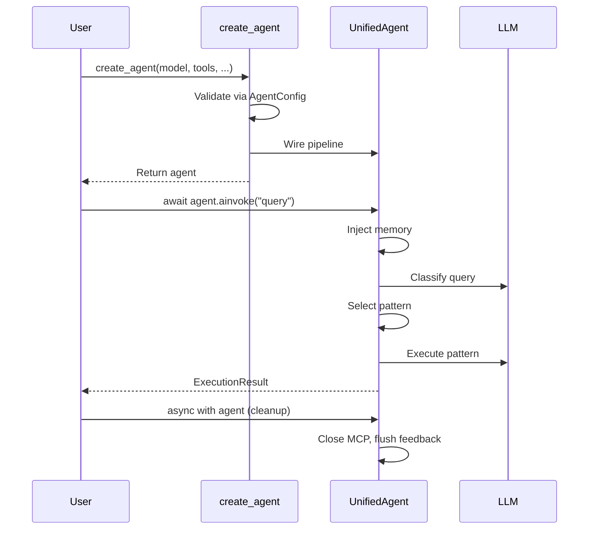

# The create_agent API

`create_agent` is the single entry point for creating agloom agents. It validates all inputs, wires up the full pipeline, and returns a ready-to-use `UnifiedAgent`.

## Signature

```python
def create_agent(
    model,                          # Required: LLM instance
    tools=None,                     # Optional: LangChain tools
    system_prompt=None,             # Optional: str or callable
    name=None,                      # Optional: agent name
    debug=False,                    # Optional: debug logging
    # ... 30+ more parameters
) -> UnifiedAgent:
```

See [All Parameters](../configuration/parameters.md) for the complete reference.

## What It Returns

`create_agent` returns a `UnifiedAgent` with these methods:

| Method | Description |
|--------|-------------|
| `await agent.ainvoke(query)` | Run the full pipeline, return `ExecutionResult` |
| `async for token in agent.astream(query)` | Stream tokens as they arrive |
| `async for event in agent.astream_events(query)` | Stream structured events |
| `await agent.abatch(queries)` | Process multiple queries in parallel |
| `await agent.feedback(run_id, rating)` | Submit user feedback for a run |
| `agent.register_pattern(name, handler)` | Register a custom pattern handler |
| `async with agent:` | Context manager for graceful cleanup |

## Validation

`create_agent` validates **all** inputs at construction time using a Pydantic model (`AgentConfig`). If anything is invalid, you get a clear error immediately — not a cryptic crash during execution.

```python
# These all raise immediately with clear messages:
create_agent(model=None)           # ValueError: model is required
create_agent(model=llm, name="")   # ValueError: name must be non-empty
create_agent(model=llm, max_concurrent=0)  # ValueError: 1 ≤ max_concurrent ≤ 32
create_agent(model=llm, interrupt_before=["INVALID"])  # ValueError: unknown pattern
```

## Minimal vs Full Configuration

```python
# Minimal — everything has sensible defaults
agent = create_agent(model=llm)

# Full production setup
agent = create_agent(
    model=llm,
    tools=[search, calculate],
    system_prompt="You are a data analyst.",
    name="analyst",
    store=InMemoryStore(),
    memory=SessionMemory(),
    debug=False,
    max_concurrent=8,
    max_retries=3,
    llm_timeout=60.0,
    rate_limit=10.0,
    feedback_handler=LTSFeedbackHandler(),
)
```

## Lifecycle


