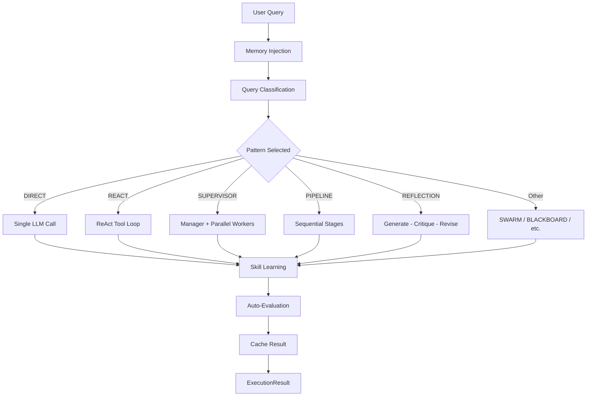
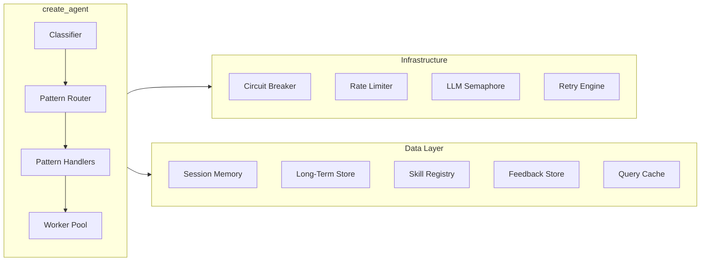

# How agloom Works

## The Pipeline

Every call to `agent.ainvoke(query)` flows through this pipeline:

## Step by Step

### 1. Memory Injection

If `memory=` or `store=` is provided, agloom retrieves:

- **Session memory** — recent conversation turns from the current thread
- **Long-term memory** — relevant memories from the user's namespace

These are prepended to the system prompt so the LLM has full context.

### 2. Query Classification

An LLM-powered classifier analyzes the query and determines:

- **Pattern** — which of the 9 execution patterns to use
- **Complexity** — 0-10 score
- **Subtasks** — for multi-agent patterns, the decomposition plan
- **Tools needed** — whether the query requires tool calling
- **Parallelizable** — whether subtasks can run concurrently

### 3. Cache Check

If `query_cache=` is set, agloom checks for semantically similar previous queries. On a cache hit, the cached result is returned immediately (saving an LLM call).

### 4. HITL Interrupts (if configured)

If `interrupt_before=` includes the selected pattern, execution pauses and calls `user_callback` for approval before proceeding.

### 5. Pattern Execution

The selected pattern handler runs the query. Each pattern is optimized for different query types (see [Execution Patterns](patterns.md)).

### 6. Skill Learning

After a successful run, the skill learner extracts reusable patterns and stores them for future use (requires `store=`).

### 7. Auto-Evaluation

The `AutoEvaluator` scores the result on relevance, completeness, and accuracy. This feeds into trend detection and skill lifecycle management.

### 8. Cache & Return

The result is cached (if `query_cache=` is set) and returned as an `ExecutionResult` containing:

- `output` — the response text
- `pattern_used` — which pattern was selected
- `steps` — step-by-step execution trace
- `token_usage` — aggregated token counts
- `run_id` — unique identifier for feedback/tracing
- `worker_results` — individual worker outputs (for multi-agent patterns)

## Architecture Diagram

## Thread Safety

agloom is fully async and thread-safe:

- **`asyncio.Lock`** protects lazy initialization (MCP, skills)
- **`asyncio.Semaphore`** gates concurrent LLM calls
- **`ThreadPoolExecutor`** offloads sync I/O (Qdrant, disk)
- Each `ainvoke` call is isolated — no shared mutable state between calls
