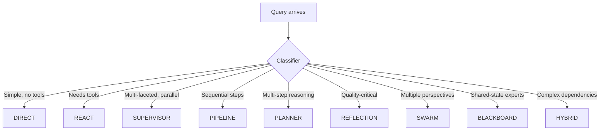
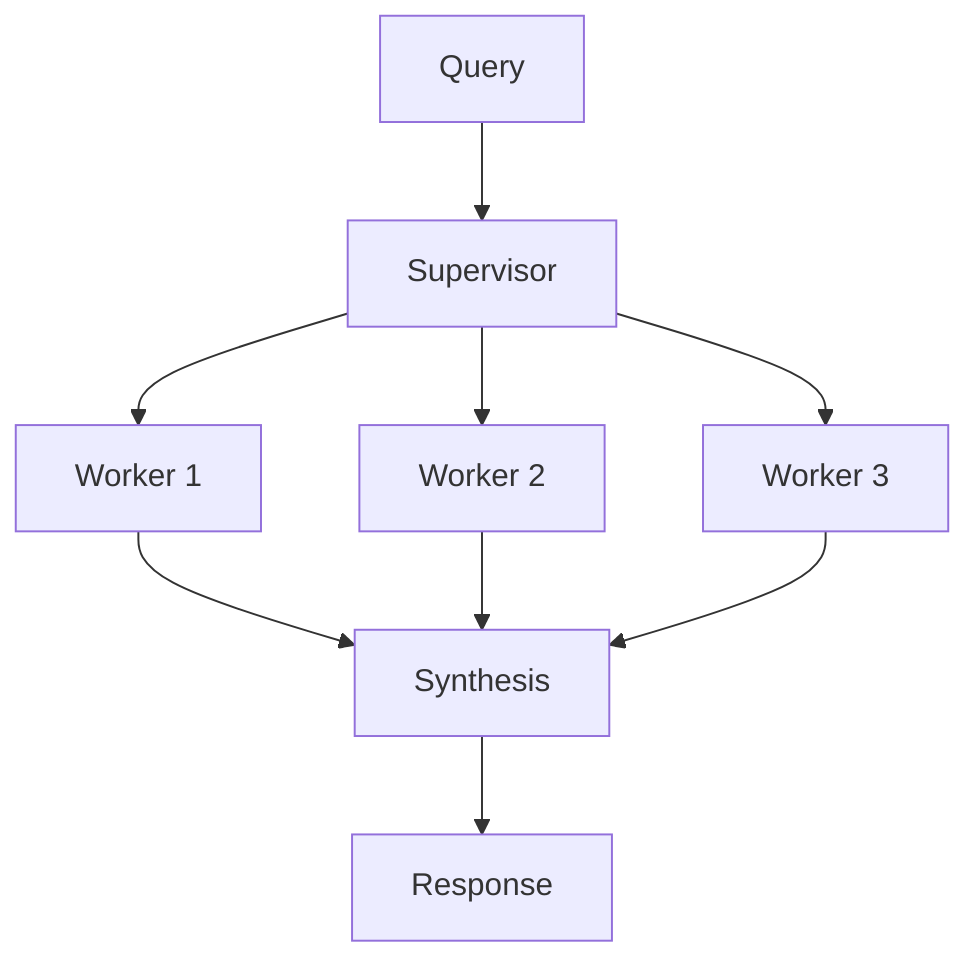
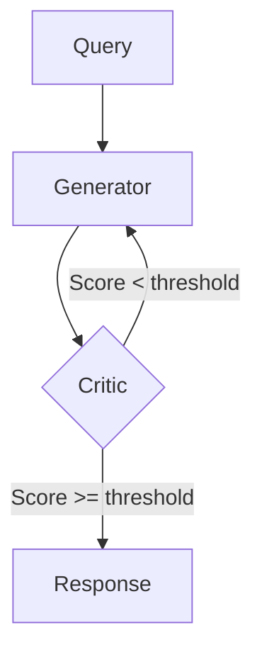

# Execution Patterns

agloom auto-selects the optimal pattern per query. You don't choose — the classifier does.

## Pattern Selection Flow



## The 9 Patterns

### DIRECT — Single LLM Call

**When selected:** Simple factual queries, greetings, straightforward instructions.

```
Query → LLM → Response
```

**Example queries:** "What is the capital of France?", "Hello!", "Summarize this in one line."

No tools, no workers, no overhead. One LLM call, one response.

---

### REACT — Tool Calling Loop

**When selected:** Queries that require tools (calculator, search, API calls).

```
Query → LLM → Tool Call → Observation → LLM → ... → Response
```

**Example queries:** "Calculate 15 * 7 + 23", "Search for the latest Python release."

The LLM reasons about what to do, calls a tool, observes the result, and repeats until done.

---

### SUPERVISOR — Manager + Parallel Workers

**When selected:** Multi-faceted queries with independent subtasks.



**Example queries:** "Compare solar, wind, and hydro energy", "Analyze marketing, sales, and support metrics."

---

### PIPELINE — Sequential Chain

**When selected:** Queries requiring ordered transformations.

```
Query → Stage 1 → Stage 2 → Stage 3 → Response
```

**Example queries:** "Extract data from this text, format it as a table, then translate to Spanish."

Each stage's output feeds into the next.

---

### PLANNER_EXECUTOR — Plan Then Execute

**When selected:** Multi-step reasoning where later steps depend on all prior context.

```
Query → Plan → Step 1 → Step 2 (+history) → Step 3 (+history) → Synthesis
```

**Example queries:** "Research, draft, review, and finalize a project proposal."

Unlike PIPELINE, each step sees the full history of all previous steps.

---

### REFLECTION — Generate, Critique, Revise

**When selected:** Quality-critical outputs that benefit from self-review.



**Example queries:** "Write a professional cover letter", "Create a detailed technical specification."

Configurable via `max_reflection_iterations` (default: 3) and `reflection_threshold` (default: 7/10).

---

### SWARM — Parallel Perspectives

**When selected:** Queries benefiting from debate or multiple viewpoints.

```
Query → [Expert A, Expert B, Expert C] → Synthesis → Response
```

**Example queries:** "What are the pros and cons of microservices vs monolith?"

---

### BLACKBOARD — Shared-State Specialists

**When selected:** Complex problems requiring collaborative expert contributions.

```
Query → Expert 1 (board) → Expert 2 (board+) → ... → Synthesis (full board)
```

Each specialist reads and writes to a shared "blackboard" state.

---

### HYBRID_DAG — Mixed Parallel + Sequential

**When selected:** Queries with complex dependency graphs.

```
Query → [Parallel A, Parallel B] → Sequential C (combined) → Response
```

Some subtasks run in parallel; their outputs feed into sequential steps.

---

## Overriding the Classifier

The classifier is automatic, but you can register custom handlers:

```python
from agloom import create_agent, ExecutionResult

async def my_handler(agent, query, analysis, config):
    # Custom logic here
    return ExecutionResult(output="Custom result", pattern_used=analysis.pattern)

agent = create_agent(model=llm, name="custom")
agent.register_pattern("REACT", my_handler)
```

!!! note "Fallback Behavior"
    If the classifier selects a pattern with no registered handler, agloom falls back to **REACT** and logs a warning:
    `[agent-name] No handler for pattern 'X' — falling back to REACT.`
