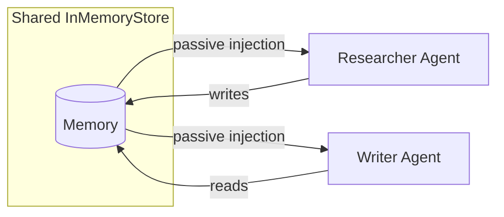

# Example: Multi-Agent

Multiple agents sharing a long-term store for collaborative workflows.

## Code

```python
"""Multi-agent with shared memory."""

import asyncio
import os

from langchain_groq import ChatGroq
from langgraph.store.memory import InMemoryStore
from agloom import create_agent

llm = ChatGroq(
    model="meta-llama/llama-4-scout-17b-16e-instruct",
    api_key=os.environ["GROQ_API_KEY"],
    temperature=0,
)


async def main():
    store = InMemoryStore()

    researcher = create_agent(
        model=llm,
        store=store,
        name="researcher",
        system_prompt="You are a research specialist. Provide detailed factual information.",
    )

    writer = create_agent(
        model=llm,
        store=store,
        name="writer",
        system_prompt="You are a concise writer. Summarize information in 2-3 sentences.",
    )

    # Researcher gathers information
    print("=== Researcher ===")
    r1 = await researcher.ainvoke(
        "What are the main benefits of renewable energy?",
        user_id="demo-user",
    )
    print(f"Pattern: {r1.pattern_used.value}")
    print(f"Output:  {r1.output[:200]}...\n")

    # Writer summarizes (can access researcher's findings via shared store)
    print("=== Writer ===")
    r2 = await writer.ainvoke(
        "Summarize the key points about renewable energy benefits",
        user_id="demo-user",
    )
    print(f"Pattern: {r2.pattern_used.value}")
    print(f"Output:  {r2.output[:200]}...\n")

    # Batch processing with the researcher
    print("=== Batch ===")
    results = await researcher.abatch(
        ["What is solar energy?", "What is wind energy?", "What is hydroelectric power?"],
        max_concurrent=3,
        user_id="demo-user",
    )
    for r in results:
        print(f"  [{r.pattern_used.value}] {r.output[:80]}...")


asyncio.run(main())
```

## Run it

```bash
python examples/05_multi_agent.py
```

## How Shared Memory Works



Both agents use the same `store` and `user_id`, so:

1. The researcher's findings are saved to the store
2. When the writer runs, relevant memories are automatically injected into its prompt
3. The writer can build on what the researcher discovered

## Important Notes

- Use **different agent names** unless you intentionally want to share skill/feedback namespaces
- Pass the same **`user_id`** at **call time** (on `ainvoke`, `astream`, etc.) to share long-term memories between agents for a specific user
- Each agent maintains its own **session memory** (auto-created) — only the long-term store is shared
- `thread_id` controls session memory isolation; `user_id` controls long-term memory namespace
