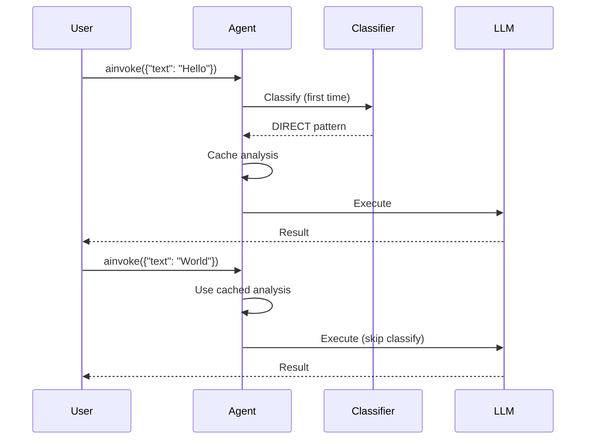

# Frozen Agents

## The Problem

Query classification adds ~200-500ms per call. For batch workloads where you're processing thousands of items with the same structure, that overhead adds up fast.

## The Solution

**Frozen agents** classify once on the first call and reuse the cached analysis for every subsequent call.

```python
agent = create_agent(
    model=llm,
    frozen=True,
    frozen_template="Translate to French: {text}",
    input_key="text",
    name="translator",
)

# First call — classifies, caches the result
r1 = await agent.ainvoke({"text": "Hello world"})        # ~700ms

# Subsequent calls — skip classification
r2 = await agent.ainvoke({"text": "Good morning"})        # ~300ms
r3 = await agent.ainvoke({"text": "Thank you"})           # ~300ms
```

## How It Works



## Configuration

| Parameter | Type | Default | Description |
|-----------|------|---------|-------------|
| `frozen` | `bool` | `False` | Enable frozen mode |
| `frozen_template` | `str` | required | Template with `{key}` placeholders |
| `input_key` | `str \| list[str]` | `"input"` | Placeholder name(s) |
| `frozen_analysis_ttl` | `float` | `0` | Cache TTL in seconds (0 = never) |

## Multiple Placeholders

```python
agent = create_agent(
    model=llm,
    frozen=True,
    frozen_template="Translate '{text}' from {source} to {target}",
    input_key=["text", "source", "target"],
    name="multi-translator",
)

result = await agent.ainvoke({
    "text": "Hello",
    "source": "English",
    "target": "Japanese",
})
```

## TTL (Time-to-Live)

Force re-classification after a period:

```python
agent = create_agent(
    model=llm,
    frozen=True,
    frozen_template="Summarize: {text}",
    input_key="text",
    frozen_analysis_ttl=3600,  # re-classify after 1 hour
    name="summarizer",
)
```

## String Inputs

Frozen agents also accept plain strings — they're mapped to the `input_key`:

```python
agent = create_agent(
    model=llm,
    frozen=True,
    frozen_template="Classify sentiment: {input}",
    name="sentiment",
)

result = await agent.ainvoke("I love this product!")  # input_key defaults to "input"
```

## Validation Errors

```python
# frozen=True requires a template
create_agent(model=llm, frozen=True)
# ValueError: frozen=True requires non-empty frozen_template

# Template must have placeholders matching input_key
create_agent(model=llm, frozen=True, frozen_template="No placeholder", input_key="text")
# Works — but {text} won't be substituted since it's not in the template

# Empty input_key is rejected
create_agent(model=llm, frozen=True, frozen_template="{x}", input_key=[])
# ValueError: frozen=True requires non-empty input_key
```

## Batch Processing

Combine frozen agents with `abatch` for maximum throughput:

```python
texts = ["Hello", "World", "Python", "AI", ...]  # thousands of items

results = await agent.abatch(
    [{"text": t} for t in texts],
    max_concurrent=8,
)
```
