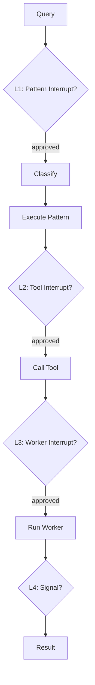

# Human-in-the-Loop (HITL)

## 4 Levels of Control

agloom provides layered interrupt control — from coarse-grained pattern pauses to fine-grained tool-level approval:



## L1: Pattern Interrupts

Pause before or after a specific pattern runs:

```python
async def my_callback(context):
    print(f"Pattern {context['pattern']} selected. Approve? (y/n)")
    return True  # True = proceed, False = abort

agent = create_agent(
    model=llm,
    interrupt_before=["SUPERVISOR", "PIPELINE"],
    interrupt_after=["REFLECTION"],
    user_callback=my_callback,
    name="guarded-agent",
)
```

**When it fires:** After classification, before the pattern handler starts (for `interrupt_before`) or after it completes (for `interrupt_after`).

!!! warning "Callback required"
    If you set `interrupt_before`/`interrupt_after` without `user_callback`, agloom logs a warning and all gates are **transparent** (fail-open):
    `AgentConfig: interrupt lists are set but user_callback=None — all gates will be transparent (fail-open). Pass user_callback=async_fn to activate HITL.`

## L2: Tool Interrupts

Pause before specific tools are called:

```python
agent = create_agent(
    model=llm,
    tools=[delete_file, read_file, write_file],
    interrupt_before_tools=["delete_file", "write_file"],
    user_callback=my_callback,
    name="safe-agent",
)
```

Read operations proceed automatically; destructive operations require approval.

## L3: Worker Interrupts

For multi-agent patterns (SUPERVISOR, PIPELINE, etc.), pause before or after specific workers:

```python
agent = create_agent(
    model=llm,
    interrupt_before_workers=["deployer"],
    interrupt_after_workers=["researcher"],
    user_callback=my_callback,
    name="supervised-agent",
)
```

## L4: Signal Queue

For programmatic control during execution. Each `ainvoke()` call creates an isolated `signal_queue` via the internal config. To send signals, access the queue from a concurrent task:

```python
import asyncio
from agloom import SignalType
from agloom.models import Signal

async def run_with_halt():
    # Launch ainvoke in a background task
    task = asyncio.create_task(agent.ainvoke("Long research query"))

    # Wait a bit, then halt all workers
    await asyncio.sleep(5)

    # Access the per-run signal queue from the agent's config
    signal_queue = agent.config["configurable"]["signal_queue"]
    await signal_queue.put(Signal(signal_type=SignalType.HALT_ALL))

    result = await task  # will complete early due to HALT_ALL
```

!!! note "Per-run isolation"
    Each `ainvoke()` call gets its own fresh `signal_queue`. Two concurrent `ainvoke()` calls cannot interfere with each other's signals.

## The user_callback Function

The callback receives context about the pending action:

```python
async def my_callback(context: dict) -> bool:
    """
    Return True to proceed, False to abort.
    context contains: action, pattern, tool_name, details, etc.
    """
    action = context.get("action", "unknown")
    print(f"Agent wants to: {action}")
    return True
```

!!! info "Error handling"
    If `user_callback` raises an exception, agloom catches it, logs a warning, and **continues** (fail-open):
    `[HITL-L1] user_callback raised Error(...) — continuing (fail-open).`

## Worker Clarification Requests

In multi-agent patterns (SUPERVISOR, PIPELINE, etc.), individual workers can ask the user for clarification during execution. This is handled automatically via the `ask_for_clarification` tool:

1. A worker encounters ambiguity and calls `ask_for_clarification("What format do you prefer?")`
2. The signal is routed through L4 (`signal_queue`) as a `CLARIFICATION_REQUEST`
3. Your `user_callback` receives the question and returns an answer
4. The answer is routed back to the specific worker (no cross-talk between concurrent workers)

```python
async def my_callback(context: dict) -> bool | str:
    action = context.get("action", "")
    if action == "clarification_request":
        question = context.get("question", "")
        print(f"Worker asks: {question}")
        return input("Your answer: ")  # return the answer string
    return True  # approve other actions

agent = create_agent(
    model=llm,
    user_callback=my_callback,
    name="clarifying-agent",
)
```

Workers time out after **300 seconds** if no answer is received, and continue with a fallback message.

## Step Tracing

HITL interrupts appear in the step trace:

```python
result = await agent.ainvoke("Deploy the application")

for step in result.steps:
    if step.type.value == "interrupt":
        print(f"Interrupted: {step.name}")
```

## Disabling HITL

Simply don't pass any interrupt parameters — HITL is opt-in, not opt-out:

```python
# No HITL — runs without any pauses
agent = create_agent(model=llm, name="auto-agent")
```
