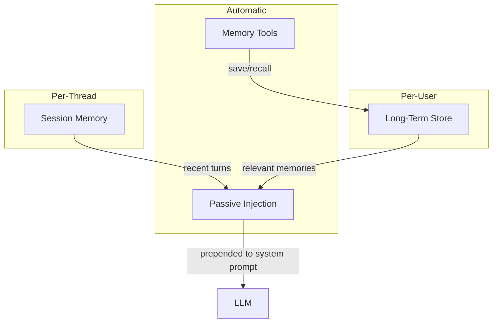
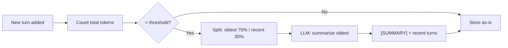

# Memory

agloom provides three layers of memory — all configured through `create_agent`.

## Memory Architecture



## Session Memory

Short-term, per-thread memory that tracks the current conversation.

!!! info "Always active"
    Session memory is **always created automatically**, even if you don't pass `memory=`. By default, agloom creates a `SessionMemory` backed by an ephemeral `InMemoryStore`. This means turns are tracked within a process but lost on restart. For persistence, pass your own `SessionMemory` with a persistent store.

```python
from agloom import create_agent, SessionMemory

# Option 1: Use defaults — session memory auto-created (ephemeral)
agent = create_agent(model=llm, name="chat-agent")

# Option 2: Explicit session memory (same behavior, but explicit)
agent = create_agent(
    model=llm,
    memory=SessionMemory(),
    session_max_turns=20,  # keep last 20 turns (default)
    name="chat-agent",
)
```

### The key: passing `thread_id`

Session memory only works across calls if you pass the **same `thread_id`**. Without `thread_id`, each call gets a random UUID and can't find previous turns:

```python
# WITHOUT thread_id — each call is isolated (ephemeral UUID)
await agent.ainvoke("My name is Alice")
await agent.ainvoke("What is my name?")  # → agent does NOT remember

# WITH thread_id — calls share session history
await agent.ainvoke("My name is Alice", thread_id="session-1")
await agent.ainvoke("What is my name?", thread_id="session-1")
# → "Your name is Alice"
```

### How it works

- Each `ainvoke` call stores the query and response as a turn under `("session", thread_id)`
- The last `session_max_turns` turns are injected into the system prompt on the next call
- Older turns are evicted (FIFO)
- Threads are isolated — different `thread_id` values get different histories

### Passing `thread_id` and `user_id`

Pass `thread_id` and `user_id` as keyword arguments to **any** runtime method (`ainvoke`, `astream`, `astream_events`, `abatch`):

```python
# Stateful conversation with session memory
result = await agent.ainvoke("My name is Alice", thread_id="session-1")
result = await agent.ainvoke("What is my name?", thread_id="session-1")
# → "Your name is Alice"

# Streaming with session context
async for token in agent.astream("Tell me more", thread_id="session-1"):
    print(token, end="")

# Event streaming with session context
async for event in agent.astream_events("Explain X",
                                         thread_id="session-1",
                                         user_id="user-42"):
    ...

# Batch — all queries share the same thread (or omit for isolated)
results = await agent.abatch(
    ["Question 1", "Question 2"],
    thread_id="session-1",
    user_id="user-42",
)
```

### Identity resolution priority

Long-term memory namespace is resolved in this order:

| Priority | Parameter | Namespace | Use case |
|----------|-----------|-----------|----------|
| 1 (highest) | `lt_namespace=(...)` | Explicit tuple | Multi-agent shared state |
| 2 | `user_id="u123"` (at **call time**) | `(agent_name, "u123")` | Cross-session user identity |
| 3 (default) | Neither passed | `(agent_name, thread_id)` | Thread-scoped (default) |

!!! warning "`user_id` must be passed at call time"
    Setting `user_id` on `create_agent()` sets a **config default** but does **not** activate user-scoped namespacing. You must pass `user_id=` on each `ainvoke()` / `astream()` / `astream_events()` / `abatch()` call for it to take effect:

    ```python
    # This does NOT scope LT memory to "alice" at call time:
    agent = create_agent(model=llm, store=store, user_id="alice")
    await agent.ainvoke("Hello")  # namespace = (agent_name, random_uuid)

    # This DOES scope LT memory to "alice":
    await agent.ainvoke("Hello", user_id="alice")  # namespace = (agent_name, "alice")
    ```

### Configuration

| Parameter | Default | Description |
|-----------|---------|-------------|
| `memory` | auto-created | `SessionMemory()` instance. Auto-created with ephemeral `InMemoryStore` if not provided |
| `session_max_turns` | `20` | Max turns to retain. Only applies to the auto-created `SessionMemory` — ignored if you pass your own `memory=SessionMemory(max_turns=N)` |

## Auto-Summarization

When conversations grow long, raw turns can consume significant context window budget. agloom automatically summarizes older turns into a compressed summary, preserving key information while freeing up tokens for the current conversation.

### How it works

1. After each turn is recorded, agloom counts the total tokens across all stored turns (using `tiktoken`)
2. If the total exceeds `summarize_threshold` (default: 200,000 tokens), summarization triggers
3. The oldest 70% of turns are compressed into a single summary turn via an LLM call
4. The most recent 30% of turns are kept intact
5. The summary replaces the oldest turns in storage



### Default behavior

Auto-summarization is **enabled by default**. No configuration needed:

```python
agent = create_agent(model=llm, name="chat-agent")
# Auto-summarization will trigger when conversation history exceeds 200k tokens
```

### Disabling auto-summarization

For latency-sensitive or cost-sensitive scenarios, disable it:

```python
agent = create_agent(
    model=llm,
    name="fast-agent",
    auto_summarize=False,  # oldest turns are dropped instead of summarized
)
```

### Using a cheaper model for summarization

By default, the agent's own model handles summarization. For cost savings, use a separate faster/cheaper model:

```python
agent = create_agent(
    model=ChatGPT(model="gpt-4o"),            # main model for agent tasks
    summarizer_model=ChatGPT(model="gpt-4o-mini"),  # cheaper model for summarization
    name="cost-efficient-agent",
)
```

### Custom threshold

Adjust when summarization triggers:

```python
agent = create_agent(
    model=llm,
    summarize_threshold=100_000,  # trigger earlier (default: 200,000)
    name="agent",
)
```

### How summaries appear in conversation history

When `format_context` renders turns for the LLM, summary turns appear with a clear header:

```
Previous conversation summary: The user discussed AI agent patterns.
They preferred the REACT pattern for tool-heavy tasks and requested...
User: What about the SUPERVISOR pattern?
Assistant: The SUPERVISOR pattern is ideal for...
```

### Configuration

| Parameter | Default | Description |
|-----------|---------|-------------|
| `auto_summarize` | `True` | Enable automatic conversation summarization |
| `summarize_threshold` | `200_000` | Token count that triggers summarization (min 10,000) |
| `summarizer_model` | `None` | Separate LLM for summarization. `None` = use agent's own model |

## Long-Term Store

Persistent, user-scoped memory backed by a LangGraph `BaseStore`:

```python
from langgraph.store.memory import InMemoryStore

agent = create_agent(
    model=llm,
    store=InMemoryStore(),
    name="memory-agent",
)

# Memories persist across sessions for this user
await agent.ainvoke("I prefer dark mode and Python", user_id="user-123")

# Later — the agent recalls user preferences
await agent.ainvoke("Set up my environment", user_id="user-123")
```

### What the store enables

When you provide `store=`, agloom automatically activates:

| Feature | Description |
|---------|-------------|
| Long-term memory | Save/retrieve user-scoped memories |
| Skill learning | Extract and reuse successful patterns |
| Feedback system | Auto-evaluation and trend detection |
| Memory tools | `save_memory` and `recall_memory` tools for the agent |

### Passive injection

Relevant memories are automatically retrieved and injected into the system prompt before each query. No code needed — agloom handles the retrieval and ranking.

!!! info "Memory trimming"
    If the injected context exceeds the configured limit, agloom trims it and logs:
    `MemoryInjection: context trimmed to N chars (was M, dropped K chars). Increase max_chars or reduce last_n/store_limit.`

## Shared Memory Across Agents

Multiple agents can share the same `store`:

```python
store = InMemoryStore()

researcher = create_agent(model=llm, store=store, name="researcher")
writer = create_agent(model=llm, store=store, name="writer")

# Researcher stores findings
await researcher.ainvoke("Research quantum computing", user_id="team")

# Writer can access the researcher's findings
await writer.ainvoke("Write a summary", user_id="team")
```

!!! warning "Duplicate agent names"
    If two agents with the **same name** share the **same store**, agloom logs a warning:
    `[agloom] Multiple agents named 'X' share the same LongTermStore. They will read/write the same skill and feedback namespaces.`

    This is by design (for advanced sharing), but if unintentional, use different names.

## Disabling Memory Tools

```python
agent = create_agent(
    model=llm,
    store=store,
    enable_memory_tools=False,  # agent can't call save/recall
    name="passive-only",
)
```

With `enable_memory_tools=False`, the agent still benefits from passive injection but cannot explicitly save or recall memories.

## Query Cache

agloom includes an optional **semantic query cache** backed by Qdrant. When enabled, repeated or semantically similar queries return cached results instantly without making LLM calls.

### Enabling the cache

```python
from agloom import create_agent, create_cache
from sentence_transformers import SentenceTransformer

# Create an embedding model for semantic similarity
embeddings = SentenceTransformer("all-MiniLM-L6-v2")

# Create the cache (in-memory Qdrant by default)
cache = create_cache(embeddings=embeddings)

agent = create_agent(
    model=llm,
    query_cache=cache,
    name="cached-agent",
)

# First call — runs full pipeline
result = await agent.ainvoke("What is photosynthesis?")

# Second call with similar wording — cache hit, returns instantly
result = await agent.ainvoke("Explain photosynthesis")
```

### `create_cache` parameters

```python
cache = create_cache(
    embeddings=embeddings,          # Required: embedding model for vector search
    similarity_threshold=0.92,      # How similar queries must be to match (default: 0.92)
    qdrant_url=None,                # Remote Qdrant server URL (default: in-memory)
    qdrant_api_key=None,            # API key for remote Qdrant
    vector_size=384,                # Embedding dimension (default: 384 for MiniLM)
)
```

### Pattern-specific TTLs

The cache applies different time-to-live values per pattern:

| Pattern | TTL | Reason |
|---------|-----|--------|
| DIRECT | 24 hours | Simple factual queries rarely change |
| REACT | 1 hour | Tool-dependent results may update |
| SUPERVISOR | 30 min | Multi-agent results may vary |
| PLANNER | 30 min | Multi-step plans may differ |
| REFLECTION | No cache | Quality-critical outputs should always be fresh |
| HYBRID_DAG | No cache | Complex pipelines should re-execute |

### Remote Qdrant (production)

For persistent caching across restarts, use a remote Qdrant server:

```python
cache = create_cache(
    embeddings=embeddings,
    qdrant_url="http://localhost:6333",
    qdrant_api_key="your-key",
)
```

!!! info "Cache is not user-scoped"
    The query cache is shared across all users and threads. It matches based on query text similarity and pattern type only. For user-specific results, the cache is bypassed when results differ.
