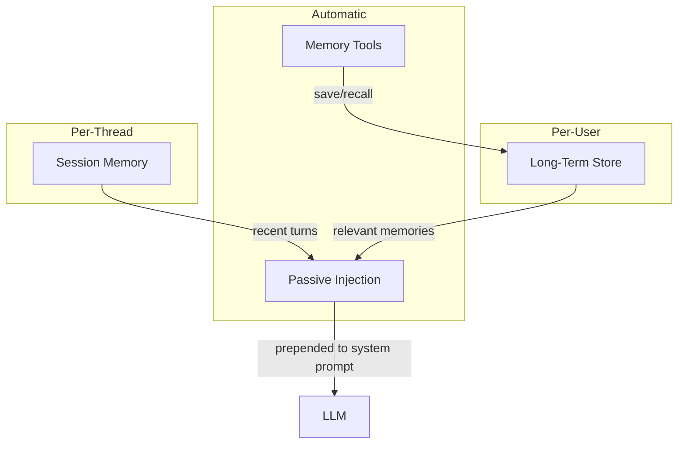

# Memory

agloom provides three layers of memory — all configured through `create_agent`.

## Memory Architecture



## Session Memory

Short-term, per-thread memory that tracks the current conversation:

```python
from agloom import create_agent, SessionMemory

agent = create_agent(
    model=llm,
    memory=SessionMemory(),
    session_max_turns=20,  # keep last 20 turns (default)
    name="chat-agent",
)

# Turn 1
await agent.ainvoke("My name is Alice")
# Turn 2 — the agent remembers
await agent.ainvoke("What is my name?")  # → "Your name is Alice"
```

### How it works

- Each `ainvoke` call stores the query and response as a turn
- The last `session_max_turns` turns are injected into the system prompt
- Older turns are evicted (FIFO)
- Threads are isolated — different thread IDs get different histories

### Configuration

| Parameter | Default | Description |
|-----------|---------|-------------|
| `memory` | `None` | `SessionMemory()` instance |
| `session_max_turns` | `20` | Max turns to retain |

## Long-Term Store

Persistent, user-scoped memory backed by a LangGraph `BaseStore`:

```python
from langgraph.store.memory import InMemoryStore

agent = create_agent(
    model=llm,
    store=InMemoryStore(),
    name="memory-agent",
)

# Memories persist across sessions for this user
await agent.ainvoke("I prefer dark mode and Python", user_id="user-123")

# Later — the agent recalls user preferences
await agent.ainvoke("Set up my environment", user_id="user-123")
```

### What the store enables

When you provide `store=`, agloom automatically activates:

| Feature | Description |
|---------|-------------|
| Long-term memory | Save/retrieve user-scoped memories |
| Skill learning | Extract and reuse successful patterns |
| Feedback system | Auto-evaluation and trend detection |
| Memory tools | `save_memory` and `recall_memory` tools for the agent |

### Passive injection

Relevant memories are automatically retrieved and injected into the system prompt before each query. No code needed — agloom handles the retrieval and ranking.

!!! info "Memory trimming"
    If the injected context exceeds the configured limit, agloom trims it and logs:
    `MemoryInjection: context trimmed to N chars (was M, dropped K chars). Increase max_chars or reduce last_n/store_limit.`

## Shared Memory Across Agents

Multiple agents can share the same `store`:

```python
store = InMemoryStore()

researcher = create_agent(model=llm, store=store, name="researcher")
writer = create_agent(model=llm, store=store, name="writer")

# Researcher stores findings
await researcher.ainvoke("Research quantum computing", user_id="team")

# Writer can access the researcher's findings
await writer.ainvoke("Write a summary", user_id="team")
```

!!! warning "Duplicate agent names"
    If two agents with the **same name** share the **same store**, agloom logs a warning:
    `[agloom] Multiple agents named 'X' share the same LongTermStore. They will read/write the same skill and feedback namespaces.`

    This is by design (for advanced sharing), but if unintentional, use different names.

## Disabling Memory Tools

```python
agent = create_agent(
    model=llm,
    store=store,
    enable_memory_tools=False,  # agent can't call save/recall
    name="passive-only",
)
```

With `enable_memory_tools=False`, the agent still benefits from passive injection but cannot explicitly save or recall memories.
